```{r setup, include=FALSE}
knitr::opts_chunk$set(echo = FALSE)
library(diagram)
```

## What is a graph?

```{r}
#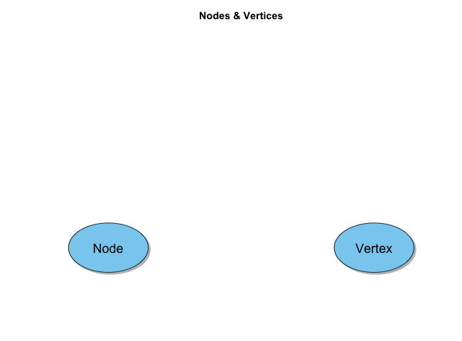
openplotmat()
pos <- coordinates(c(3,3,3))
textellipse(pos[7,], .1, lab = 'Node', box.col = '#89cff0',
            shadow.size = .005, cex = 1.5)
title("Nodes\n")
```

## What is a graph?

```{r}
#
openplotmat()
textellipse(pos[7,], .1, lab = 'Node', box.col = '#89cff0',
            shadow.size = .005, cex = 1.5)
textellipse(pos[9,], .1, lab = 'Vertex', box.col = '#89cff0',
            shadow.size = .005, cex = 1.5)
title("Nodes & Vertices\n")
```

## What is a graph?

```{r}
#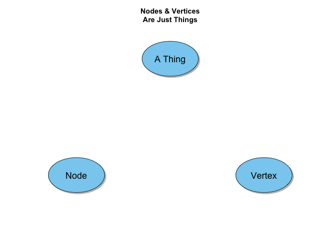
openplotmat()
textellipse(pos[2,], .1, lab = 'A Thing', box.col = '#89cff0',
            shadow.size = .005, cex = 1.5)
textellipse(pos[7,], .1, lab = 'Node', box.col = '#89cff0',
            shadow.size = .005, cex = 1.5)
textellipse(pos[9,], .1, lab = 'Vertex', box.col = '#89cff0',
            shadow.size = .005, cex = 1.5)
title("Nodes & Vertices\nAre Just Things")
```

## What is a graph?

```{r}
pos = coordinates(c(3,3,3,3))
openplotmat()
textellipse(pos[2,], .1, lab = 'A Thing', box.col = '#89cff0',
            shadow.size = .005, cex = 1.5)
textellipse(pos[7,], .1, lab = 'Node', box.col = '#89cff0',
            shadow.size = .005, cex = 1.5)
textellipse(pos[9,], .1, lab = 'Vertex', box.col = '#89cff0',
            shadow.size = .005, cex = 1.5)
text(pos[7,1], pos[7,2], 'id: #1', pos = 1, cex = 1, offset = 2)
text(pos[9,1], pos[9,2], 'id: #2', pos = 1, cex = 1, offset = 2)
text(pos[2,1], pos[2,2], 'id: #3', pos = 1, cex = 1, offset = 2)
text(pos[7,1], pos[7,2], 'type: person', pos = 1, cex = 1, offset = 3)
text(pos[9,1], pos[9,2], 'type: place', pos = 1, cex = 1, offset = 3)
text(pos[2,1], pos[2,2], 'type: thing', pos = 1, cex = 1, offset = 3)
title("Nodes & Vertices\nAre Just Things")
```

## What is a graph?

```{r}
#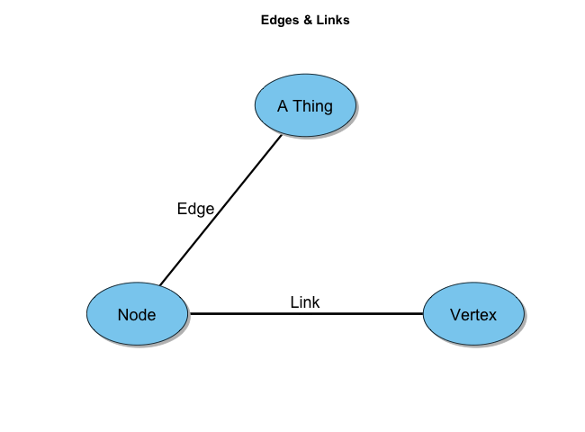
openplotmat()
straightarrow(pos[7,], pos[2,], lwd = 3, arr.width = 0)

text(mean(c(pos[7,1], pos[2,1])),
     mean(c(pos[7,2], pos[2,2])),
     "Edge    ",
     pos = 2,
     cex = 1.5)
textellipse(pos[2,], .1, lab = 'A Thing', box.col = '#89cff0',
            shadow.size = .005, cex = 1.5)
textellipse(pos[7,], .1, lab = 'Node', box.col = '#89cff0',
            shadow.size = .005, cex = 1.5)
textellipse(pos[9,], .1, lab = 'Vertex', box.col = '#89cff0',
            shadow.size = .005, cex = 1.5)
text(pos[7,1], pos[7,2], 'id: #1', pos = 1, cex = 1, offset = 2)
text(pos[9,1], pos[9,2], 'id: #2', pos = 1, cex = 1, offset = 2)
text(pos[2,1], pos[2,2], 'id: #3', pos = 1, cex = 1, offset = 2)
text(pos[7,1], pos[7,2], 'type: person', pos = 1, cex = 1, offset = 3)
text(pos[9,1], pos[9,2], 'type: place', pos = 1, cex = 1, offset = 3)
text(pos[2,1], pos[2,2], 'type: thing', pos = 1, cex = 1, offset = 3)
title("Edges\n")
```

## What is a graph?

```{r}
#
openplotmat()
straightarrow(pos[7,], pos[2,], lwd = 3, arr.width = 0)
straightarrow(pos[7,], pos[9,], lwd = 3, arr.width = 0)
straightarrow(pos[9,], pos[7,], lwd = 3, arr.width = 0)
text(mean(c(pos[7,1], pos[9,1])),
     mean(c(pos[7,2], pos[9,2])),
     "Link",
     pos = 1,
     cex = 1.5)
text(mean(c(pos[7,1], pos[2,1])),
     mean(c(pos[7,2], pos[2,2])),
     "Edge    ",
     pos = 2,
     cex = 1.5)
textellipse(pos[2,], .1, lab = 'A Thing', box.col = '#89cff0',
            shadow.size = .005, cex = 1.5)
textellipse(pos[7,], .1, lab = 'Node', box.col = '#89cff0',
            shadow.size = .005, cex = 1.5)
textellipse(pos[9,], .1, lab = 'Vertex', box.col = '#89cff0',
            shadow.size = .005, cex = 1.5)
text(pos[7,1], pos[7,2], 'id: #1', pos = 1, cex = 1, offset = 2)
text(pos[9,1], pos[9,2], 'id: #2', pos = 1, cex = 1, offset = 2)
text(pos[2,1], pos[2,2], 'id: #3', pos = 1, cex = 1, offset = 2)
text(pos[7,1], pos[7,2], 'type: person', pos = 1, cex = 1, offset = 3)
text(pos[9,1], pos[9,2], 'type: place', pos = 1, cex = 1, offset = 3)
text(pos[2,1], pos[2,2], 'type: thing', pos = 1, cex = 1, offset = 3)
title("Edges & Links\n")
```

## What is a graph?

```{r}
#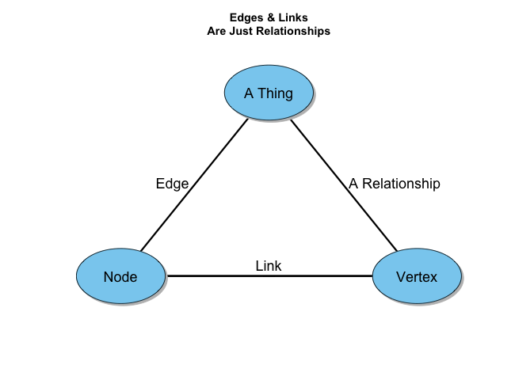
openplotmat()
straightarrow(pos[7,], pos[2,], lwd = 3, arr.width = 0)
straightarrow(pos[9,], pos[2,], lwd = 3, arr.width = 0)
straightarrow(pos[7,], pos[9,], lwd = 3, arr.width = 0)
straightarrow(pos[9,], pos[7,], lwd = 3, arr.width = 0)
text(mean(c(pos[7,1], pos[9,1])),
     mean(c(pos[7,2], pos[9,2])),
     "Link",
     pos = 1,
     cex = 1.5)
text(mean(c(pos[7,1], pos[2,1])),
     mean(c(pos[7,2], pos[2,2])),
     "Edge    ",
     pos = 2,
     cex = 1.5)
text(mean(c(pos[9,1], pos[2,1])),
     mean(c(pos[9,2], pos[2,2])),
     "  A Relationship",
     pos = 4,
     cex = 1.5)
textellipse(pos[2,], .1, lab = 'A Thing', box.col = '#89cff0',
            shadow.size = .005, cex = 1.5)
textellipse(pos[7,], .1, lab = 'Node', box.col = '#89cff0',
            shadow.size = .005, cex = 1.5)
textellipse(pos[9,], .1, lab = 'Vertex', box.col = '#89cff0',
            shadow.size = .005, cex = 1.5)
text(pos[7,1], pos[7,2], 'id: #1', pos = 1, cex = 1, offset = 2)
text(pos[9,1], pos[9,2], 'id: #2', pos = 1, cex = 1, offset = 2)
text(pos[2,1], pos[2,2], 'id: #3', pos = 1, cex = 1, offset = 2)
text(pos[7,1], pos[7,2], 'type: person', pos = 1, cex = 1, offset = 3)
text(pos[9,1], pos[9,2], 'type: place', pos = 1, cex = 1, offset = 3)
text(pos[2,1], pos[2,2], 'type: thing', pos = 1, cex = 1, offset = 3)
title("Edges & Links\nAre Just Relationships")
```


## What is a graph?

```{r}
#
openplotmat()
straightarrow(pos[7,], pos[2,], lwd = 3, arr.width = 0)
straightarrow(pos[9,], pos[2,], lwd = 3, arr.width = 0)
straightarrow(pos[7,], pos[9,], lwd = 3, arr.width = 0)
straightarrow(pos[9,], pos[7,], lwd = 3, arr.width = 0)
text(mean(c(pos[7,1], pos[9,1])),
     mean(c(pos[7,2], pos[9,2])),
     "Link",
     pos = 1,
     cex = 1.5)
text(mean(c(pos[7,1], pos[2,1])),
     mean(c(pos[7,2], pos[2,2])),
     "Edge    ",
     pos = 2,
     cex = 1.5)
text(mean(c(pos[9,1], pos[2,1])),
     mean(c(pos[9,2], pos[2,2])),
     "  A Relationship",
     pos = 4,
     cex = 1.5)
text(mean(c(pos[7,1], pos[9,1])),
     mean(c(pos[7,2], pos[9,2])),
     "Strong",
     pos = 1,
     cex = 1,
     offset = 2)
text(mean(c(pos[7,1], pos[2,1])),
     mean(c(pos[7,2], pos[2,2])),
     "Weak\n\n",
     pos = 2,
     cex = 1,
     offset = 2)
text(mean(c(pos[9,1], pos[2,1])),
     mean(c(pos[9,2], pos[2,2])),
     "Neutral\n\n",
     pos = 4,
     cex = 1,
     offset = 2)
textellipse(pos[2,], .1, lab = 'A Thing', box.col = '#89cff0',
            shadow.size = .005, cex = 1.5)
textellipse(pos[7,], .1, lab = 'Node', box.col = '#89cff0',
            shadow.size = .005, cex = 1.5)
textellipse(pos[9,], .1, lab = 'Vertex', box.col = '#89cff0',
            shadow.size = .005, cex = 1.5)
text(pos[7,1], pos[7,2], 'id: #1', pos = 1, cex = 1, offset = 2)
text(pos[9,1], pos[9,2], 'id: #2', pos = 1, cex = 1, offset = 2)
text(pos[2,1], pos[2,2], 'id: #3', pos = 1, cex = 1, offset = 2)
text(pos[7,1], pos[7,2], 'type: person', pos = 1, cex = 1, offset = 3)
text(pos[9,1], pos[9,2], 'type: place', pos = 1, cex = 1, offset = 3)
text(pos[2,1], pos[2,2], 'type: thing', pos = 1, cex = 1, offset = 3)
title("Edges & Links\nAre Just Relationships")
```

## What is a graph?

```{r}
#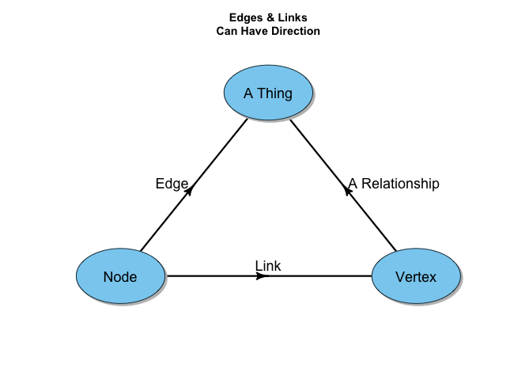
openplotmat()
straightarrow(pos[7,], pos[2,], lwd = 3, arr.lwd = 3, arr.adj =1)
straightarrow(pos[9,], pos[2,], lwd = 3, arr.lwd = 3, arr.adj = 1)
straightarrow(pos[7,], pos[9,], lwd = 3, arr.lwd = 3, arr.adj = 1)
text(mean(c(pos[7,1], pos[9,1])),
     mean(c(pos[7,2], pos[9,2])),
     "Link",
     cex = 1.5,
     pos = 1)
text(mean(c(pos[7,1], pos[2,1])),
     mean(c(pos[7,2], pos[2,2])),
     "Edge    ",
     pos = 2,
     cex = 1.5)
text(mean(c(pos[9,1], pos[2,1])),
     mean(c(pos[9,2], pos[2,2])),
     "  A Relationship",
     pos = 4,
     cex = 1.5)
textellipse(pos[2,], .1, lab = 'A Thing', box.col = '#89cff0',
            shadow.size = .005, cex = 1.5)
textellipse(pos[7,], .1, lab = 'Node', box.col = '#89cff0',
            shadow.size = .005, cex = 1.5)
textellipse(pos[9,], .1, lab = 'Vertex', box.col = '#89cff0',
            shadow.size = .005, cex = 1.5)
text(mean(c(pos[7,1], pos[9,1])),
     mean(c(pos[7,2], pos[9,2])),
     "Strong",
     pos = 1,
     cex = 1,
     offset = 2)
text(mean(c(pos[7,1], pos[2,1])),
     mean(c(pos[7,2], pos[2,2])),
     "Weak\n\n",
     pos = 2,
     cex = 1,
     offset = 2)
text(mean(c(pos[9,1], pos[2,1])),
     mean(c(pos[9,2], pos[2,2])),
     "Neutral\n\n",
     pos = 4,
     cex = 1,
     offset = 2)
text(pos[7,1], pos[7,2], 'id: #1', pos = 1, cex = 1, offset = 2)
text(pos[9,1], pos[9,2], 'id: #2', pos = 1, cex = 1, offset = 2)
text(pos[2,1], pos[2,2], 'id: #3', pos = 1, cex = 1, offset = 2)
text(pos[7,1], pos[7,2], 'type: person', pos = 1, cex = 1, offset = 3)
text(pos[9,1], pos[9,2], 'type: place', pos = 1, cex = 1, offset = 3)
text(pos[2,1], pos[2,2], 'type: thing', pos = 1, cex = 1, offset = 3)
title("Edges & Links\nCan Have Direction")
```

## What is a graph?

```{r}
#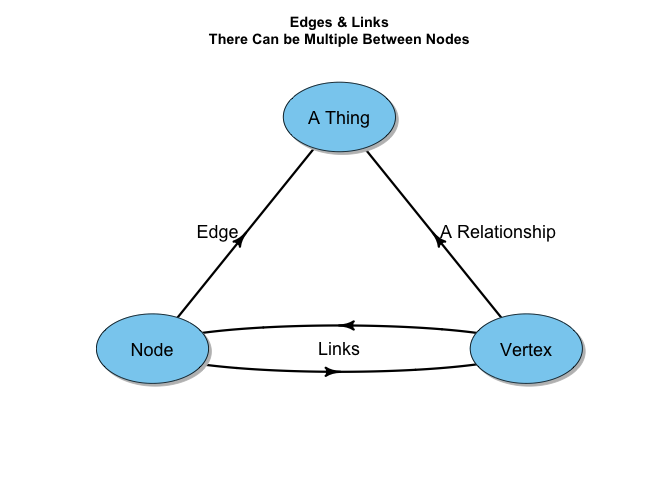
openplotmat()
straightarrow(pos[7,], pos[2,], lwd = 3, arr.lwd = 3, arr.adj =1)
straightarrow(pos[9,], pos[2,], lwd = 3, arr.lwd = 3, arr.adj = 1)
curvedarrow(pos[7,], pos[9,], lwd = 3, arr.lwd = 3, arr.adj = 1, curve = .1)
curvedarrow(pos[9,], pos[7,], lwd = 3, arr.lwd = 3, arr.adj = 1, curve = .1)
text(mean(c(pos[7,1], pos[9,1])),
     mean(c(pos[7,2], pos[9,2])),
     "Links",
     cex = 1.5)
text(mean(c(pos[7,1], pos[2,1])),
     mean(c(pos[7,2], pos[2,2])),
     "Edge    ",
     pos = 2,
     cex = 1.5)
text(mean(c(pos[9,1], pos[2,1])),
     mean(c(pos[9,2], pos[2,2])),
     "  A Relationship",
     pos = 4,
     cex = 1.5)
textellipse(pos[2,], .1, lab = 'A Thing', box.col = '#89cff0',
            shadow.size = .005, cex = 1.5)
textellipse(pos[7,], .1, lab = 'Node', box.col = '#89cff0',
            shadow.size = .005, cex = 1.5)
textellipse(pos[9,], .1, lab = 'Vertex', box.col = '#89cff0',
            shadow.size = .005, cex = 1.5)
text(mean(c(pos[7,1], pos[9,1])),
     mean(c(pos[7,2], pos[9,2])),
     "Strong",
     pos = 3,
     cex = 1,
     offset = 1.5)
text(mean(c(pos[7,1], pos[9,1])),
     mean(c(pos[7,2], pos[9,2])),
     "Not as Strong",
     pos = 1,
     cex = 1,
     offset = 1.5)
text(mean(c(pos[7,1], pos[2,1])),
     mean(c(pos[7,2], pos[2,2])),
     "Weak\n\n",
     pos = 2,
     cex = 1,
     offset = 2)
text(mean(c(pos[9,1], pos[2,1])),
     mean(c(pos[9,2], pos[2,2])),
     "Neutral\n\n",
     pos = 4,
     cex = 1,
     offset = 2)
text(pos[7,1], pos[7,2], 'id: #1', pos = 1, cex = 1, offset = 2)
text(pos[9,1], pos[9,2], 'id: #2', pos = 1, cex = 1, offset = 2)
text(pos[2,1], pos[2,2], 'id: #3', pos = 1, cex = 1, offset = 2)
text(pos[7,1], pos[7,2], 'type: person', pos = 1, cex = 1, offset = 3)
text(pos[9,1], pos[9,2], 'type: place', pos = 1, cex = 1, offset = 3)
text(pos[2,1], pos[2,2], 'type: thing', pos = 1, cex = 1, offset = 3)
title("Edges & Links\nThere Can be Multiple Between Nodes")
```

## What is a graph?

```{r}
pos <- coordinates(c(5,5,5,5,5))
openplotmat()

john2jess <- curvedarrow(pos[11,], pos[13,], lwd = 3, arr.lwd = 3, arr.adj = 1, curve = .1)
jess2john <- curvedarrow(pos[13,], pos[11,], lwd = 3, arr.lwd = 3, arr.adj = 1, curve = .1)
jess2jared <- curvedarrow(pos[13,], pos[15,], lwd = 3, arr.lwd = 3, arr.adj = 1, curve = .1)
jared2jess <- curvedarrow(pos[15,], pos[13], lwd = 3, arr.lwd = 3, arr.adj = 1, curve = .1)

text(john2jess[1], john2jess[2], 'Sister Of', pos = 3, offset = 2)
text(jess2john[1], jess2john[2], 'Brother Of', pos = 1, offset = 2)
text(jess2jared[1], jess2jared[2], 'Wife Of', pos = 1, offset = 1)
text(jared2jess[1], jared2jess[2], 'Husband Of', pos = 3, offset = 1)


textellipse(pos[11,], .075, lab = 'John', box.col = '#8da0cb',
            shadow.size = .005, cex = 1.5)
text(pos[11,1], pos[11,2], 'Gender: Male', pos = 1, cex = 1, offset = 2)
text(pos[11,1], pos[11,2], 'Job: Doctor', pos = 1, cex = 1, offset = 3)
textellipse(pos[13,], .075, lab = 'Jessica', box.col = '#8da0cb',
            shadow.size = .005, cex = 1.5)
text(pos[13,1], pos[13,2], 'Gender: Female', pos = 1, cex = 1, offset = 2)
text(pos[13,1], pos[13,2], 'Job: Doctor', pos = 1, cex = 1, offset = 3)
textellipse(pos[15,], .075, lab = 'Jared', box.col = '#8da0cb',
            shadow.size = .005, cex = 1.5)

text(pos[15,1], pos[15,2], 'Gender: Male', pos = 1, cex = 1, offset = 2)
text(pos[15,1], pos[15,2], 'Job: Politician', pos = 1, cex = 1, offset = 3)
title("Property Graph")
```

## What is a graph?

```{r}
pos <- coordinates(c(5,5,5,5,5))
openplotmat()

john2jess <- curvedarrow(pos[11,], pos[13,], lwd = 3, arr.lwd = 2, curve = .1)
jess2john <- curvedarrow(pos[13,], pos[11,], lwd = 3, arr.lwd = 2, curve = .1)
jess2jared <- curvedarrow(pos[13,], pos[15,], lwd = 3, arr.lwd = 2, curve = .1)
jared2jess <- curvedarrow(pos[15,], pos[13,], lwd = 3, arr.lwd = 2, curve = .1)
john2male <- straightarrow(pos[11,], pos[3,], lwd = 3, arr.lwd = 2)
jared2male <- straightarrow(pos[15,], pos[3,], lwd = 3, arr.lwd = 2)
jared2pol <- straightarrow(pos[15,], pos[5,], lwd = 3, arr.lwd = 2)
jess2doc <- straightarrow(pos[13,], pos[22,], lwd = 3, arr.lwd = 2)
john2doc <- straightarrow(pos[11,], pos[22,], lwd = 3, arr.lwd = 2)
jess2female <- straightarrow(pos[13,], pos[24,], lwd = 3, arr.lwd = 2)

text(john2jess[1], john2jess[2], 'Sister Of', pos = 3, offset = 2, cex = .75)
text(jess2john[1], jess2john[2], 'Brother Of', pos = 1, offset = 2, cex = .75)
text(jess2jared[1], jess2jared[2], 'Wife Of', pos = 1, offset = 1, cex = .75)
text(jared2jess[1], jared2jess[2], 'Husband Of', pos = 3, offset = 1, cex = .75)
text(john2male[1], john2male[2], 'has gender', pos = 2, offset = 1, cex = .75)
text(jess2female[1], jess2female[2], 'has gender', pos=4, offset = 1, cex = .75)
text(jared2male[1], jared2male[2], 'has gender', pos=4, offset = 1, cex = .75)
text(john2doc[1], john2doc[2], 'has job', pos = 2, offset = 1, cex = .75)
text(jess2doc[1], jess2doc[2], 'has job', pos = 4, offset = 1, cex = .75)
text(jared2pol[1], jared2pol[2], 'has job', pos = 4, offset = 1, cex = .75)


textellipse(pos[11,], .075, lab = 'John', box.col = '#8da0cb',
            shadow.size = .005, cex = 1.5)
textellipse(pos[22,], .075, lab = 'Doctor', box.col = '#fc8d62',
            shadow.size = .005, cex = 1.5)
textellipse(pos[5,], .075, lab = 'Politician', box.col = '#fc8d62',
            shadow.size = .005, cex = 1.5)
textellipse(pos[3,], .075, lab = 'Male', box.col = '#66c2a5',
            shadow.size = .005, cex = 1.5)
textellipse(pos[24,], .075, lab = 'Female', box.col = '#66c2a5',
            shadow.size = .005, cex = 1.5)
textellipse(pos[13,], .075, lab = 'Jessica', box.col = '#8da0cb',
            shadow.size = .005, cex = 1.5)
textellipse(pos[15,], .075, lab = 'Jared', box.col = '#8da0cb',
            shadow.size = .005, cex = 1.5)
title("RDF Graph")
```

## Why Graph? Social Network Analysis
```{r out.width = '650px'}
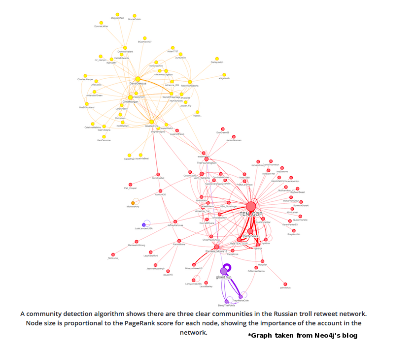
```

## Why Graph? Recommendation
```{r out.width = '700px'}

```

## Why Graph? Knowledge Graphs
```{r out.width = '700px'}
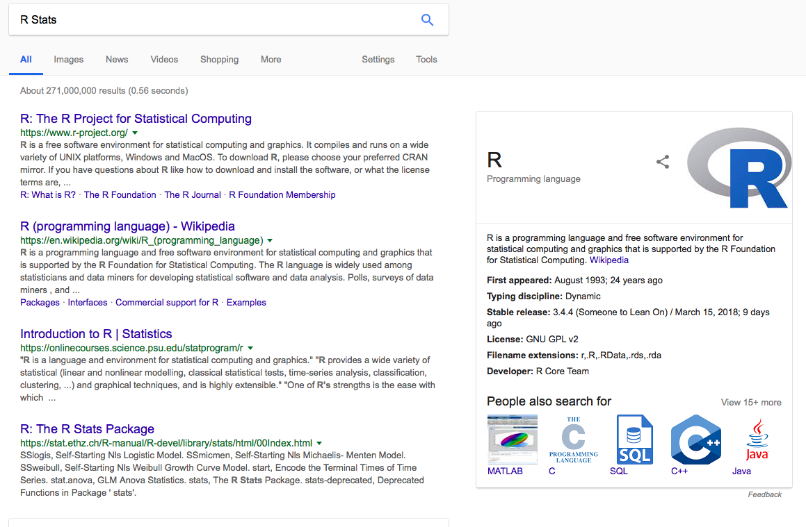
```

## Why Graph? Fraud Detection
```{r, out.width = "650px"}
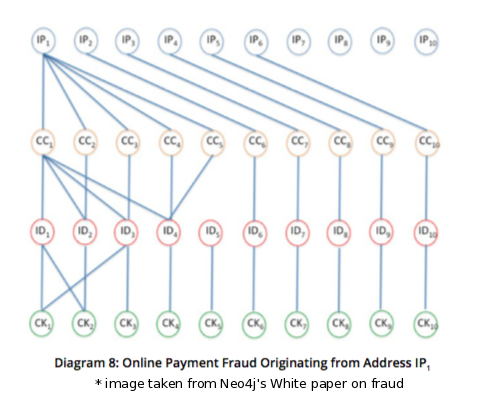
```

## Why Graph? NLP
```{r, out.width = '650px'}
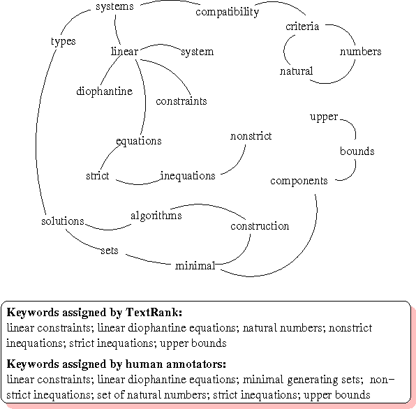
```

## Why Graph? Databases 1
```{r, out.width = '700px'}
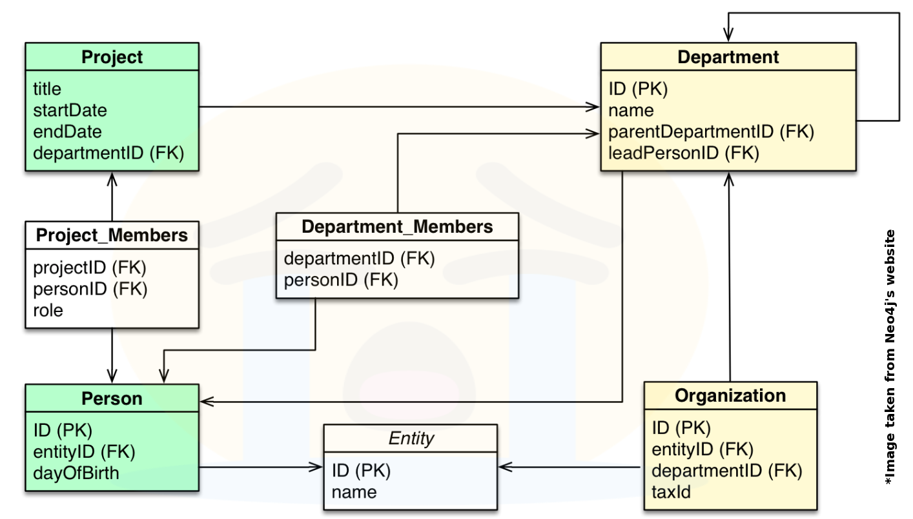
```

## Why Graph? Databases 2
```{r, out.width = '700px'}
knitr::include_graphics('part_1_images/graph_dbs.png')
```

## IGRAPH!!!!!

let's begin...
