GRAPHS
========================================================
author: 
date: 
autosize: true
<style>
.small-code pre code {
  font-size: 1em;
}
</style>


What is a graph?
====
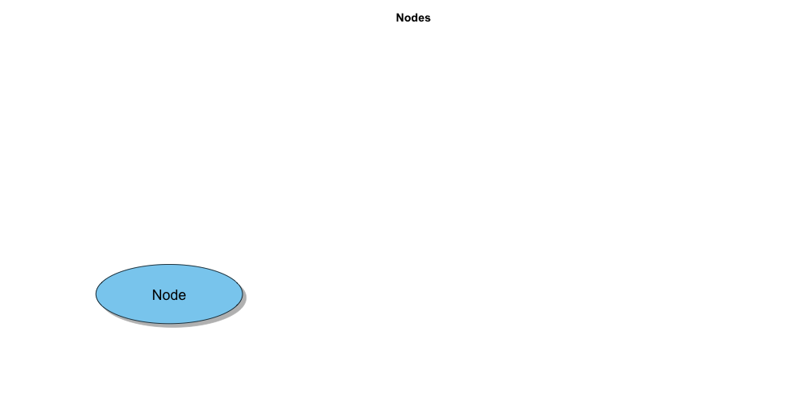
 
What is a graph?
====
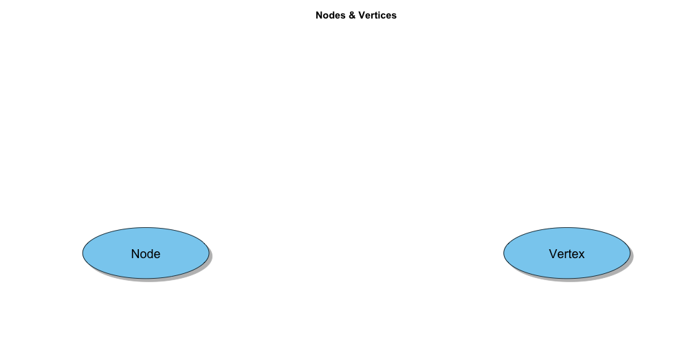

What is a graph?
====
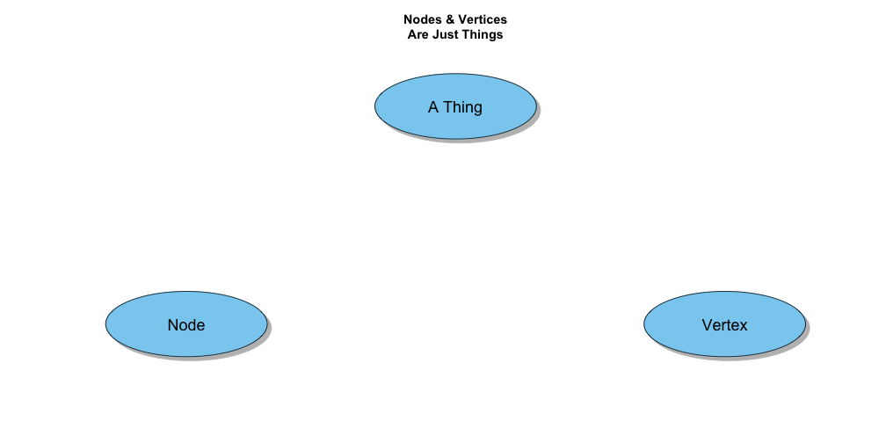

What is a graph?
====
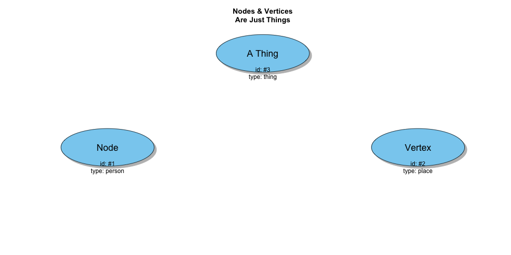

What is a graph?
=====
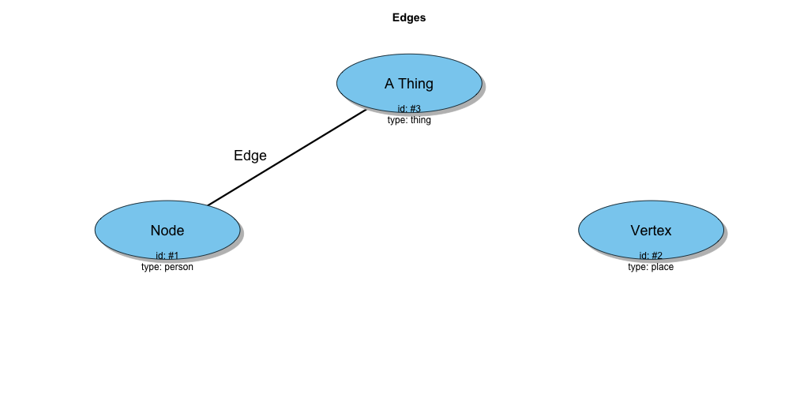

What is a graph?
===
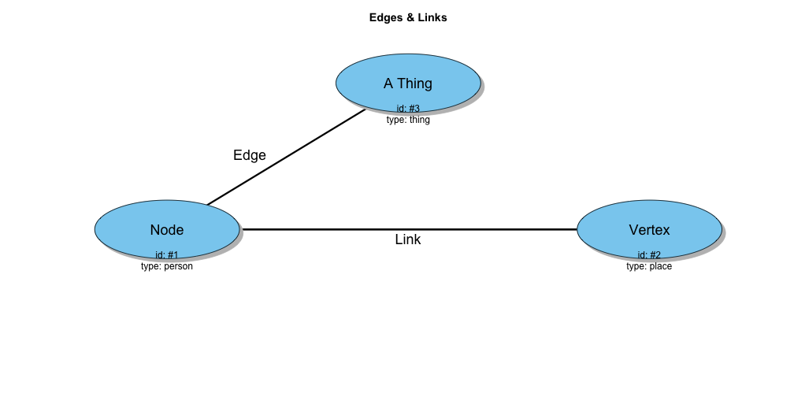

What is a graph?
===
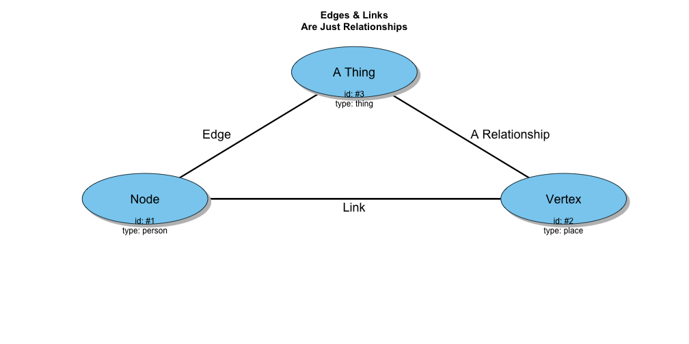


What is a graph?
=====


What is a graph?
=====
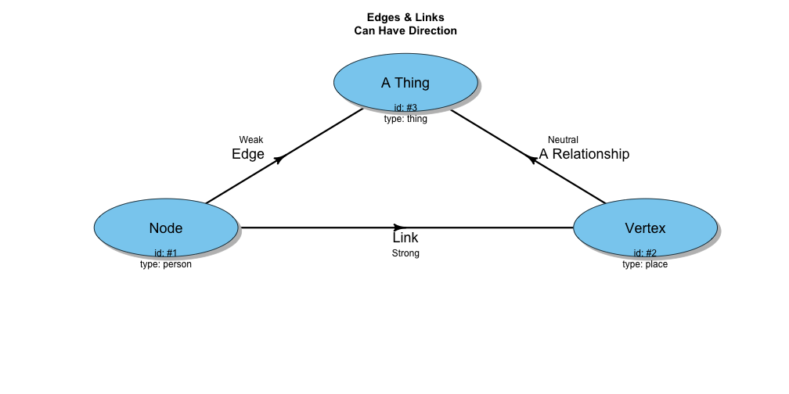

What is a graph?
===
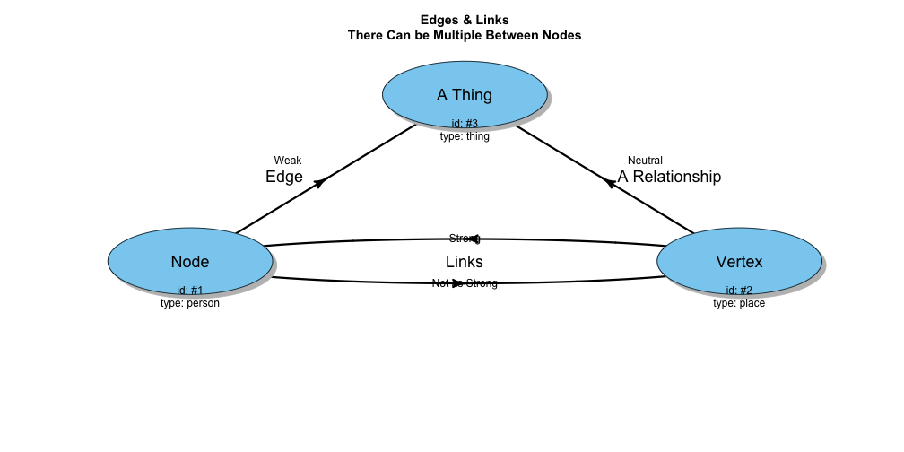

What is a graph?
===
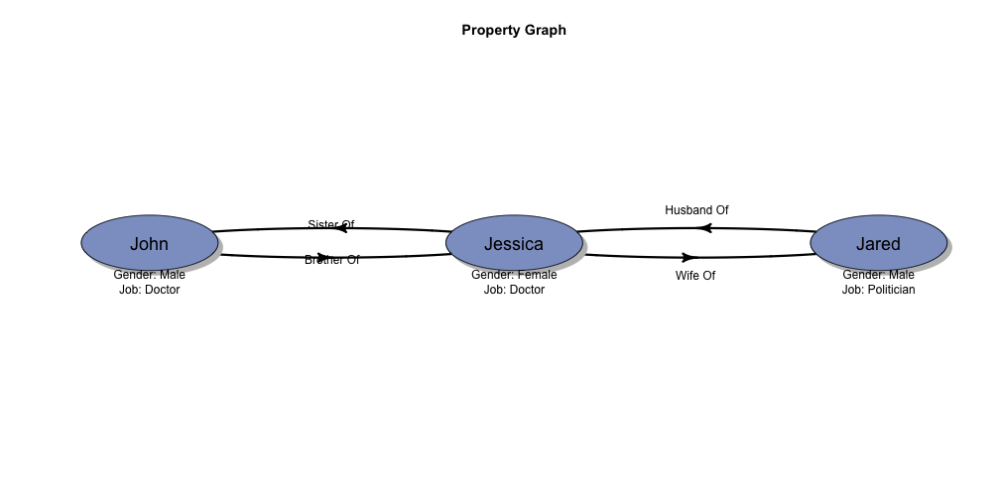

What is a graph?
===
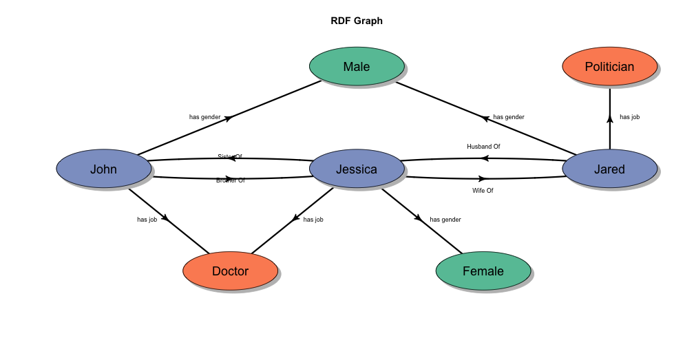

Why Graph? Social Network Analysis
===


Why Graph? Recommendation
===


Why Graph? Knowledge Graphs
===


Why Graph? Fraud Detection
====


Why Graph? NLP
===


Why Graph? Databases 1
===


Why Graph? Databases 2
====


IGRAPH!!!!!
====
let's begin...

Build Graph from Nothing
====
class: small-code

```r
library(igraph)
g <- make_empty_graph(directed = T) +
  vertices(c('a', 'b', 'c', 'd', 'e'),
           type = "letter",
           order = c(1, 2, 3, 4, 5)) +
  edges(c('a', 'b',
          'b', 'c',
          'b', 'd',
          'c', 'b',
          'c', 'e'),
        type = "is connected to",
        weight = c(1, 1, 2, 1, 2))

g
```

```
IGRAPH fcd961c DNWB 5 5 -- 
+ attr: name (v/c), type (v/c), order (v/n), type (e/c), weight
| (e/n)
+ edges from fcd961c (vertex names):
[1] a->b b->c b->d c->b c->e
```

Build Graph from Nothing
============
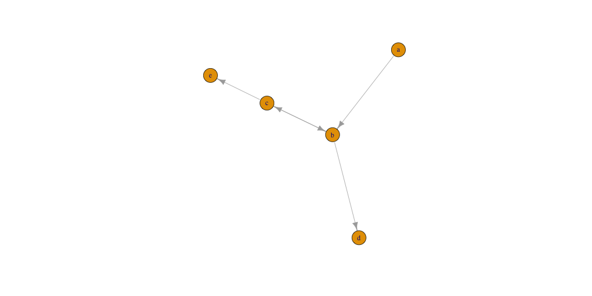

Build Graph from Matrix
=====
class: small-code

```r
src <- c('a', 'b', 'b', 'c', 'c')
tgt <- c('b', 'c', 'd', 'b', 'e')
wgt <- c(1, 1, 2, 1, 2)
matData <- matrix(0, nrow = 5, ncol = 5, dimnames = list(letters[1:5], letters[1:5]))

sapply(seq_along(src), function(i){
  matData[src[i], tgt[i]] <<- wgt[i]
})
```

```
[1] 1 1 2 1 2
```

```r
matData
```

```
  a b c d e
a 0 1 0 0 0
b 0 0 1 2 0
c 0 1 0 0 2
d 0 0 0 0 0
e 0 0 0 0 0
```


Build Graph from Matrix
=====
class: small-code


Build Matrix from Graph
====
class: small-code

```r
as_adjacency_matrix(g)
```

```
5 x 5 sparse Matrix of class "dgCMatrix"
  a b c d e
a . 1 . . .
b . . 1 1 .
c . 1 . . 1
d . . . . .
e . . . . .
```

```r
as_adjacency_matrix(g, attr = 'weight')
```

```
5 x 5 sparse Matrix of class "dgCMatrix"
  a b c d e
a . 1 . . .
b . . 1 2 .
c . 1 . . 2
d . . . . .
e . . . . .
```

Build Graph from Data Frame(s)
===
class: small-code

```r
node_list <- data.frame(
  name = c('a', 'b', 'c', 'd', 'e'),
  type = "letter",
  order = c(1, 2, 3, 4, 5)
)

edge_list <- data.frame(
  source = c('a', 'b', 'b', 'c', 'c'),
  target = c('b', 'c', 'd', 'b', 'e'),
  type = 'is connected to',
  weight = c(1, 1, 2, 1, 2)
)
g <- graph_from_data_frame(d = edge_list, 
                           directed = T,
                           vertices = node_list)
```

Build Graph from Data Frame(s)
=====


Build Data Frame(s) from Graph
====
class:small-code

```r
as_data_frame(g, 'both')
```

```
$vertices
  name   type order
a    a letter     1
b    b letter     2
c    c letter     3
d    d letter     4
e    e letter     5

$edges
  from to            type weight
1    a  b is connected to      1
2    b  c is connected to      1
3    b  d is connected to      2
4    c  b is connected to      1
5    c  e is connected to      2
```

Accessing Vertices
====

```r
V(g)
```

```
+ 5/5 vertices, named, from 2ee3296:
[1] a b c d e
```

Accessing Vertices
====

```r
V(g)[3]
```

```
+ 1/5 vertex, named, from 2ee3296:
[1] c
```

```r
V(g)['c']
```

```
+ 1/5 vertex, named, from 2ee3296:
[1] c
```

```r
V(g)[['c']]
```

```
+ 1/5 vertex, named, from 2ee3296:
  name   type order
3    c letter     3
```

Accessing/Setting Vertices
====
class:small-code

```r
V(g)$order
```

```
[1] 1 2 3 4 5
```

```r
V(g)['c']$order 
```

```
[1] 3
```

```r
V(g)['c']$order <- 1

g <- set_vertex_attr(g, name = 'entity', value = 'A NODE!')

V(g)[[]]
```

```
+ 5/5 vertices, named, from 2ee3296:
  name   type order  entity
1    a letter     1 A NODE!
2    b letter     2 A NODE!
3    c letter     1 A NODE!
4    d letter     4 A NODE!
5    e letter     5 A NODE!
```

Querying Vertices
====

```r
V(g)[[c('a', 'c')]]
```

```
+ 2/5 vertices, named, from 2ee3296:
  name   type order  entity
1    a letter     1 A NODE!
3    c letter     1 A NODE!
```

```r
V(g)[[order == 1]]
```

```
+ 2/5 vertices, named, from 2ee3296:
  name   type order  entity
1    a letter     1 A NODE!
3    c letter     1 A NODE!
```

Vertices are just vectors
=====

```r
ab <- V(g)[[c('a', 'b')]]
de <- V(g)[[c('d', 'e')]]
aa <- V(g)[[c('a', 'a')]]
c(ab, de, aa)
```

```
+ 6/5 vertices, named, from 2ee3296:
[1] a b d e a a
```

Accessing Edges
====
class:small-code

```r
E(g)
```

```
+ 5/5 edges from 2ee3296 (vertex names):
[1] a->b b->c b->d c->b c->e
```

```r
E(g)[weight == 2]
```

```
+ 2/5 edges from 2ee3296 (vertex names):
[1] b->d c->e
```

```r
E(g)[[weight == 2]]
```

```
+ 2/5 edges from 2ee3296 (vertex names):
  tail head tid hid            type weight
3    b    d   2   4 is connected to      2
5    c    e   3   5 is connected to      2
```

Setting Edges
====
class:small-code

```r
E(g)[weight == 2]$weight <- -20000

g <- set_edge_attr(g, 'entity', value = 'A LINK!')

E(g)[[]]
```

```
+ 5/5 edges from 2ee3296 (vertex names):
  tail head tid hid            type weight  entity
1    a    b   1   2 is connected to      1 A LINK!
2    b    c   2   3 is connected to      1 A LINK!
3    b    d   2   4 is connected to -20000 A LINK!
4    c    b   3   2 is connected to      1 A LINK!
5    c    e   3   5 is connected to -20000 A LINK!
```

ASCII ART - Querying Edges
====
class:small-code

```r
E(g)['a' %<-% 'b']
```

```
+ 0/5 edges from 2ee3296 (vertex names):
```

```r
#you don't need to know the specific name of the vertices
E(g)['c' %->% V(g)]
```

```
+ 2/5 edges from 2ee3296 (vertex names):
[1] c->b c->e
```

```r
#you don't need to know the specific direction of edges
E(g)['b' %--% V(g)]
```

```
+ 4/5 edges from 2ee3296 (vertex names):
[1] a->b b->c b->d c->b
```

Edges are just vectors
====

```r
b <- E(g)['b' %->% V(g)]
c <- E(g)['c' %->% V(g)]
c(b, c)
```

```
+ 4/5 edges from 2ee3296 (vertex names):
[1] b->c b->d c->b c->e
```

Subgraph - Using Vertices
====

```r
abc_sub <- induced_subgraph(g, c('a', 'b', 'c'))
abc_sub
```

```
IGRAPH 5b3c186 DNWB 3 3 -- 
+ attr: name (v/c), type (v/c), order (v/n), entity (v/c), type
| (e/c), weight (e/n), entity (e/c)
+ edges from 5b3c186 (vertex names):
[1] a->b b->c c->b
```

Subgraph - Using Edges
=====

```r
b_sub <- subgraph.edges(g, E(g)["b" %--% V(g)])
b_sub
```

```
IGRAPH 2d87327 DNWB 4 4 -- 
+ attr: name (v/c), type (v/c), order (v/n), entity (v/c), type
| (e/c), weight (e/n), entity (e/c)
+ edges from 2d87327 (vertex names):
[1] a->b b->c b->d c->b
```

Subgraph - By Deletion
====

```r
g - V(g)['c']
```

```
IGRAPH 870fb95 DNWB 4 2 -- 
+ attr: name (v/c), type (v/c), order (v/n), entity (v/c), type
| (e/c), weight (e/n), entity (e/c)
+ edges from 870fb95 (vertex names):
[1] a->b b->d
```

Subgraph - By Deletion
====

```r
g - E(g)[weight < 1]
```

```
IGRAPH c7b64ab DNWB 5 3 -- 
+ attr: name (v/c), type (v/c), order (v/n), entity (v/c), type
| (e/c), weight (e/n), entity (e/c)
+ edges from c7b64ab (vertex names):
[1] a->b b->c c->b
```
