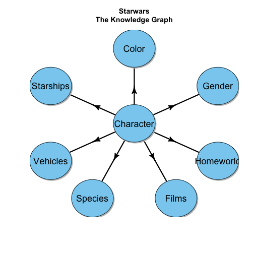
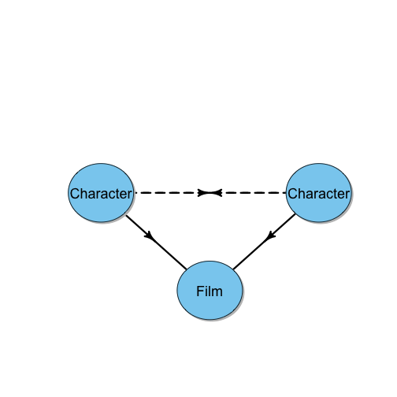
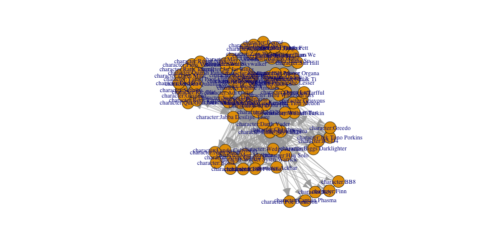
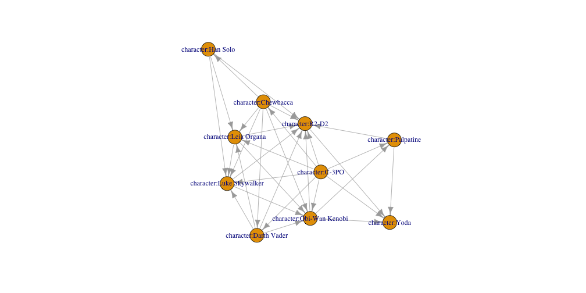

The Tidyverse: 
========================================================
author: 
date: 
autosize: true
Graph Creation and Exploration with the Tidyverse!

<style>
.small-code pre code {
  font-size: 1em;
}
</style>

graph_from_data_frame()
========================================================

A graph can be created with either one or two data frames

- a data frame of edges is required
    - requires that the first two columns represents the **from** nodes and the **to** nodes
    - any subsequent column represents an edge attribute
- a data frame that represents the nodes is optional
    - requires that the first column represents **unique names** of the nodes referred to in the data frame of edges
    - any subsequent column represents a node attribute

tidyverse
========================================================

the **tidyverse** has revolutionized the creation and manipulation of vectors and data frames

- **magrittr**
- **dplyr**
- **purr**
- **stringr**
- **tibble**
- **tidyr**
- **...**


tidyverse + graph_from_data_frame() = <3
========================================================

Because a graph can be represented with only two data frames, the **tidyverse** makes graph creation incredibly easy. 

Because nodes and edges in **igraph** are just vectors, the **tidyverse** provides amazing shortcuts to graph traversals.

**This section is dedicated to the tidyverse because of these advantages**

mutlitple functions - as variables
========================================================
class: small-code

```r
x <- 1:3
x <- letters[x]
x <- paste(x, 'is a letter in the alphabet')
x <- toupper(x)
x
```

```
[1] "A IS A LETTER IN THE ALPHABET" "B IS A LETTER IN THE ALPHABET"
[3] "C IS A LETTER IN THE ALPHABET"
```

multiple functions - nested within eachother
========================================================
class: small-code

```r
toupper(
  paste(
    letters[1:3], 'is a letter in the alphabet'
    )
  )
```

```
[1] "A IS A LETTER IN THE ALPHABET" "B IS A LETTER IN THE ALPHABET"
[3] "C IS A LETTER IN THE ALPHABET"
```

multiple functions - with magrittr's pipe
========================================================
class: small-code

```r
1:3 %>%
  letters[.] %>%
  paste(., 'is a letter in the alphabet') %>%
  toupper
```

```
[1] "A IS A LETTER IN THE ALPHABET" "B IS A LETTER IN THE ALPHABET"
[3] "C IS A LETTER IN THE ALPHABET"
```

multiple functions - piping anonymous functions 
========================================================
class: small-code

```r
1:3 %>%
{
  paste(letters[.], 'is letter number', ., 'out of', length(.))
} %>%
  toupper
```

```
[1] "A IS LETTER NUMBER 1 OUT OF 3" "B IS LETTER NUMBER 2 OUT OF 3"
[3] "C IS LETTER NUMBER 3 OUT OF 3"
```

multiple functions - piping within anonymous functions 
========================================================
class: small-code

```r
1:3 %>%
  (function(x){
    squared = x * x
    paste(letters[x], 'squared is', letters[squared]) %>%
      toupper
  })
```

```
[1] "A SQUARED IS A" "B SQUARED IS D" "C SQUARED IS I"
```

vectors - filtering normally
========================================================
class: small-code

```r
myVector <- 1:10
myVector[myVector %% 2 == 0]
```

```
[1]  2  4  6  8 10
```

vectors - filtering with the pipe
========================================================
class: small-code

```r
myVector <- 1:10

myVector %>%
  .[. %% 2 == 0]
```

```
[1]  2  4  6  8 10
```

```r
myVector %>%
  exp() %>%
  floor() %>%
  .[. %% 2  == 0]
```

```
[1]     2    20    54   148  1096  2980 22026
```

data frames - filtering normally
============
class: small-code

```r
iris[iris$Species == 'setosa',] %>%
  head()
```

```
  Sepal.Length Sepal.Width Petal.Length Petal.Width Species
1          5.1         3.5          1.4         0.2  setosa
2          4.9         3.0          1.4         0.2  setosa
3          4.7         3.2          1.3         0.2  setosa
4          4.6         3.1          1.5         0.2  setosa
5          5.0         3.6          1.4         0.2  setosa
6          5.4         3.9          1.7         0.4  setosa
```

data frames - filtering with dplyr
======
class: small-code

```r
iris %>%
  filter(Species == 'setosa') %>%
  head()
```

```
  Sepal.Length Sepal.Width Petal.Length Petal.Width Species
1          5.1         3.5          1.4         0.2  setosa
2          4.9         3.0          1.4         0.2  setosa
3          4.7         3.2          1.3         0.2  setosa
4          4.6         3.1          1.5         0.2  setosa
5          5.0         3.6          1.4         0.2  setosa
6          5.4         3.9          1.7         0.4  setosa
```

data frames - base column creation
=====
class: small-code

```r
tempIris <- iris
tempIris$sepalArea = iris$Sepal.Length * iris$Sepal.Width
tempIris[1:5, c('Sepal.Length', 'Sepal.Width', 'sepalArea')]
```

```
  Sepal.Length Sepal.Width sepalArea
1          5.1         3.5     17.85
2          4.9         3.0     14.70
3          4.7         3.2     15.04
4          4.6         3.1     14.26
5          5.0         3.6     18.00
```

data frames - dplyr column creation
=====
class: small-code

```r
iris %>%
  mutate(sepalArea = Sepal.Length * Sepal.Width) %>%
  select(Sepal.Length, Sepal.Width, sepalArea) %>%
  head(5)
```

```
  Sepal.Length Sepal.Width sepalArea
1          5.1         3.5     17.85
2          4.9         3.0     14.70
3          4.7         3.2     15.04
4          4.6         3.1     14.26
5          5.0         3.6     18.00
```

data frame - base summarization
====
class: small-code

```r
aggregate(. ~ Species, data = iris, mean)
```

```
     Species Sepal.Length Sepal.Width Petal.Length Petal.Width
1     setosa        5.006       3.428        1.462       0.246
2 versicolor        5.936       2.770        4.260       1.326
3  virginica        6.588       2.974        5.552       2.026
```

data frame - dplyr summarization
=====
class: small-code

```r
iris %>%
  group_by(Species) %>%
  summarize_all(mean) 
```

```
# A tibble: 3 x 5
  Species    Sepal.Length Sepal.Width Petal.Length Petal.Width
  <fct>             <dbl>       <dbl>        <dbl>       <dbl>
1 setosa             5.01        3.43         1.46       0.246
2 versicolor         5.94        2.77         4.26       1.33 
3 virginica          6.59        2.97         5.55       2.03 
```

data frame - dplyr summarization with different functions
====
class: small-code

```r
iris %>%
  group_by(Species) %>%
  summarize(
    MinPedalLength = median(Petal.Length),
    MaxPedalWidth = max(Petal.Width),
    MedianSepalLength = median(Sepal.Length),
    MeanSepalWidth = mean(Sepal.Width)
  )
```

```
# A tibble: 3 x 5
  Species    MinPedalLength MaxPedalWidth MedianSepalLength MeanSepalWidth
  <fct>               <dbl>         <dbl>             <dbl>          <dbl>
1 setosa               1.50         0.600              5.00           3.43
2 versicolor           4.35         1.80               5.90           2.77
3 virginica            5.55         2.50               6.50           2.97
```

data frame - tidyr nesting
====
class: small-code

```r
iris %>%
  group_by(Species) %>%
  nest()
```

```
# A tibble: 3 x 2
  Species    data             
  <fct>      <list>           
1 setosa     <tibble [50 × 4]>
2 versicolor <tibble [50 × 4]>
3 virginica  <tibble [50 × 4]>
```

iteration - base (l)apply rowwise
======
class: small-code

```r
lapply(seq_along(iris$Species), function(i){
  iris$Sepal.Length[i] + 
    iris$Sepal.Width[i] +
    iris$Petal.Length[i] +
    iris$Petal.Width[i]
})
```

```
[[1]]
[1] 10.2

[[2]]
[1] 9.5

[[3]]
[1] 9.4

[[4]]
[1] 9.4

[[5]]
[1] 10.2

[[6]]
[1] 11.4

[[7]]
[1] 9.7

[[8]]
[1] 10.1

[[9]]
[1] 8.9

[[10]]
[1] 9.6

[[11]]
[1] 10.8

[[12]]
[1] 10

[[13]]
[1] 9.3

[[14]]
[1] 8.5

[[15]]
[1] 11.2

[[16]]
[1] 12

[[17]]
[1] 11

[[18]]
[1] 10.3

[[19]]
[1] 11.5

[[20]]
[1] 10.7

[[21]]
[1] 10.7

[[22]]
[1] 10.7

[[23]]
[1] 9.4

[[24]]
[1] 10.6

[[25]]
[1] 10.3

[[26]]
[1] 9.8

[[27]]
[1] 10.4

[[28]]
[1] 10.4

[[29]]
[1] 10.2

[[30]]
[1] 9.7

[[31]]
[1] 9.7

[[32]]
[1] 10.7

[[33]]
[1] 10.9

[[34]]
[1] 11.3

[[35]]
[1] 9.7

[[36]]
[1] 9.6

[[37]]
[1] 10.5

[[38]]
[1] 10

[[39]]
[1] 8.9

[[40]]
[1] 10.2

[[41]]
[1] 10.1

[[42]]
[1] 8.4

[[43]]
[1] 9.1

[[44]]
[1] 10.7

[[45]]
[1] 11.2

[[46]]
[1] 9.5

[[47]]
[1] 10.7

[[48]]
[1] 9.4

[[49]]
[1] 10.7

[[50]]
[1] 9.9

[[51]]
[1] 16.3

[[52]]
[1] 15.6

[[53]]
[1] 16.4

[[54]]
[1] 13.1

[[55]]
[1] 15.4

[[56]]
[1] 14.3

[[57]]
[1] 15.9

[[58]]
[1] 11.6

[[59]]
[1] 15.4

[[60]]
[1] 13.2

[[61]]
[1] 11.5

[[62]]
[1] 14.6

[[63]]
[1] 13.2

[[64]]
[1] 15.1

[[65]]
[1] 13.4

[[66]]
[1] 15.6

[[67]]
[1] 14.6

[[68]]
[1] 13.6

[[69]]
[1] 14.4

[[70]]
[1] 13.1

[[71]]
[1] 15.7

[[72]]
[1] 14.2

[[73]]
[1] 15.2

[[74]]
[1] 14.8

[[75]]
[1] 14.9

[[76]]
[1] 15.4

[[77]]
[1] 15.8

[[78]]
[1] 16.4

[[79]]
[1] 14.9

[[80]]
[1] 12.8

[[81]]
[1] 12.8

[[82]]
[1] 12.6

[[83]]
[1] 13.6

[[84]]
[1] 15.4

[[85]]
[1] 14.4

[[86]]
[1] 15.5

[[87]]
[1] 16

[[88]]
[1] 14.3

[[89]]
[1] 14

[[90]]
[1] 13.3

[[91]]
[1] 13.7

[[92]]
[1] 15.1

[[93]]
[1] 13.6

[[94]]
[1] 11.6

[[95]]
[1] 13.8

[[96]]
[1] 14.1

[[97]]
[1] 14.1

[[98]]
[1] 14.7

[[99]]
[1] 11.7

[[100]]
[1] 13.9

[[101]]
[1] 18.1

[[102]]
[1] 15.5

[[103]]
[1] 18.1

[[104]]
[1] 16.6

[[105]]
[1] 17.5

[[106]]
[1] 19.3

[[107]]
[1] 13.6

[[108]]
[1] 18.3

[[109]]
[1] 16.8

[[110]]
[1] 19.4

[[111]]
[1] 16.8

[[112]]
[1] 16.3

[[113]]
[1] 17.4

[[114]]
[1] 15.2

[[115]]
[1] 16.1

[[116]]
[1] 17.2

[[117]]
[1] 16.8

[[118]]
[1] 20.4

[[119]]
[1] 19.5

[[120]]
[1] 14.7

[[121]]
[1] 18.1

[[122]]
[1] 15.3

[[123]]
[1] 19.2

[[124]]
[1] 15.7

[[125]]
[1] 17.8

[[126]]
[1] 18.2

[[127]]
[1] 15.6

[[128]]
[1] 15.8

[[129]]
[1] 16.9

[[130]]
[1] 17.6

[[131]]
[1] 18.2

[[132]]
[1] 20.1

[[133]]
[1] 17

[[134]]
[1] 15.7

[[135]]
[1] 15.7

[[136]]
[1] 19.1

[[137]]
[1] 17.7

[[138]]
[1] 16.8

[[139]]
[1] 15.6

[[140]]
[1] 17.5

[[141]]
[1] 17.8

[[142]]
[1] 17.4

[[143]]
[1] 15.5

[[144]]
[1] 18.2

[[145]]
[1] 18.2

[[146]]
[1] 17.2

[[147]]
[1] 15.7

[[148]]
[1] 16.7

[[149]]
[1] 17.3

[[150]]
[1] 15.8
```

iteration - purrr pmap rowwise
====
class: small-code

```r
iris %>%
  pmap(
    function(Sepal.Length, Sepal.Width, Petal.Length, Petal.Width, ...){
      Sepal.Length + 
        Sepal.Width + 
        Petal.Length +
        Petal.Width
      }) %>%
  head()
```

```
[[1]]
[1] 10.2

[[2]]
[1] 9.5

[[3]]
[1] 9.4

[[4]]
[1] 9.4

[[5]]
[1] 10.2

[[6]]
[1] 11.4
```


iteration - base apply columnwise
====
class: small-code

```r
apply(iris[which(names(iris) != 'Species')], 2, sum)
```

```
Sepal.Length  Sepal.Width Petal.Length  Petal.Width 
       876.5        458.6        563.7        179.9 
```


... and now with igraph...
=====
class: small-code
we'll create a knowledge graph with the **starwars** dataset


```r
starwars %>%
  summarise_all(typeof) %>%
  transpose %>%
  unlist %>%
  enframe
```

```
# A tibble: 13 x 2
   name       value    
   <chr>      <chr>    
 1 name       character
 2 height     integer  
 3 mass       double   
 4 hair_color character
 5 skin_color character
 6 eye_color  character
 7 birth_year double   
 8 gender     character
 9 homeworld  character
10 species    character
11 films      list     
12 vehicles   list     
13 starships  list     
```

starwars graph schema
========
class: small-code

```
NULL
```

```
NULL
```




Starwars Graph - Edge List Creation: Planning DF
====
class: small-code

```r
el_schema <- tibble(
  from = 'name',
  to = names(starwars) %>% .[!. %in% c('name', 'height', 'mass', 'birth_year')],
  type = to
)
el_schema
```

```
# A tibble: 9 x 3
  from  to         type      
  <chr> <chr>      <chr>     
1 name  hair_color hair_color
2 name  skin_color skin_color
3 name  eye_color  eye_color 
4 name  gender     gender    
5 name  homeworld  homeworld 
6 name  species    species   
7 name  films      films     
8 name  vehicles   vehicles  
9 name  starships  starships 
```

Starwars Graph - Edge List Creation: Planning Function
====
class: small-code

```r
el_function <- function(from, to, type){
  starwars %>%
    select(from, to) %>%
    unnest() %>%
    mutate(type = type) %>%
    rename_(
      'from' = from,
      'to' = to
    )
}
```

Starwars Graph - Edge List Creation: Execution
====
class: small-code

```r
el <- pmap(el_schema, el_function) %>%
  bind_rows() %>%
  filter(!is.na(to))
el
```

```
# A tibble: 716 x 3
   from               to            type      
   <chr>              <chr>         <chr>     
 1 Luke Skywalker     blond         hair_color
 2 Darth Vader        none          hair_color
 3 Leia Organa        brown         hair_color
 4 Owen Lars          brown, grey   hair_color
 5 Beru Whitesun lars brown         hair_color
 6 Biggs Darklighter  black         hair_color
 7 Obi-Wan Kenobi     auburn, white hair_color
 8 Anakin Skywalker   blond         hair_color
 9 Wilhuff Tarkin     auburn, grey  hair_color
10 Chewbacca          brown         hair_color
# ... with 706 more rows
```

Starwars Graph - Edge List: Clean Up
====
class: small-code

```r
el %<>%
  mutate(to = map(to, function(x){
    str_split(x, ',') %>% 
      unlist %>%
      str_trim()
  }) ) %>%
  unnest %>%
  mutate(
    from = str_c('character:', from),
    to = pmap_chr(., function(to, type, ...){
      str_c(type, ':', to)
    })
  ) %>%
  select(from, to, type)
```

Starwars Graph - Edge List: Final
====
class: small-code

```r
el
```

```
# A tibble: 738 x 3
   from                         to                type      
   <chr>                        <chr>             <chr>     
 1 character:Luke Skywalker     hair_color:blond  hair_color
 2 character:Darth Vader        hair_color:none   hair_color
 3 character:Leia Organa        hair_color:brown  hair_color
 4 character:Owen Lars          hair_color:brown  hair_color
 5 character:Owen Lars          hair_color:grey   hair_color
 6 character:Beru Whitesun lars hair_color:brown  hair_color
 7 character:Biggs Darklighter  hair_color:black  hair_color
 8 character:Obi-Wan Kenobi     hair_color:auburn hair_color
 9 character:Obi-Wan Kenobi     hair_color:white  hair_color
10 character:Anakin Skywalker   hair_color:blond  hair_color
# ... with 728 more rows
```

Starwars Graph - Node List
=====
class: small-code

```r
nl <- el %>%
  {c(.$from, .$to)} %>%
  unique %>%
  tibble(
    name = .,
    type = sapply(str_split(., ':'), '[[', 1), 
    data = lapply(., function(x){
      if(str_detect(x, '^character')){
        starwars %>%
          filter(name == str_replace(x, 'character:', '')) %>%
          select(height, mass, birth_year)
      } else {
        tibble(height = NA,
               mass = NA,
               birth_year = NA)
      }})
    ) %>%
  unnest()
```

Starwars Graph - Node List
====
class: small-code

```r
nl
```

```
# A tibble: 253 x 5
   name                         type      height  mass birth_year
   <chr>                        <chr>      <int> <dbl>      <dbl>
 1 character:Luke Skywalker     character    172   77.       19.0
 2 character:Darth Vader        character    202  136.       41.9
 3 character:Leia Organa        character    150   49.       19.0
 4 character:Owen Lars          character    178  120.       52.0
 5 character:Beru Whitesun lars character    165   75.       47.0
 6 character:Biggs Darklighter  character    183   84.       24.0
 7 character:Obi-Wan Kenobi     character    182   77.       57.0
 8 character:Anakin Skywalker   character    188   84.       41.9
 9 character:Wilhuff Tarkin     character    180   NA        64.0
10 character:Chewbacca          character    228  112.      200. 
# ... with 243 more rows
```

Starwars Graph - All Direct Relationships
=====
class: small-code

```r
library(igraph)
g <- graph_from_data_frame(el, T, nl)
g
```

```
IGRAPH d767af7 DN-B 253 738 -- 
+ attr: name (v/c), type (v/c), height (v/n), mass (v/n),
| birth_year (v/n), type (e/c)
+ edges from d767af7 (vertex names):
 [1] character:Luke Skywalker    ->hair_color:blond 
 [2] character:Darth Vader       ->hair_color:none  
 [3] character:Leia Organa       ->hair_color:brown 
 [4] character:Owen Lars         ->hair_color:brown 
 [5] character:Owen Lars         ->hair_color:grey  
 [6] character:Beru Whitesun lars->hair_color:brown 
 [7] character:Biggs Darklighter ->hair_color:black 
+ ... omitted several edges
```

Starwars Graph - Indirect Relationships
=====
class: small-code


```
NULL
```

Starwars Graph - Indirect Relationships
====
class: small-code

```r
character_film <- starwars %>%
  select(name, films) %>%
  unnest() 

character_film
```

```
# A tibble: 173 x 2
   name           films                  
   <chr>          <chr>                  
 1 Luke Skywalker Revenge of the Sith    
 2 Luke Skywalker Return of the Jedi     
 3 Luke Skywalker The Empire Strikes Back
 4 Luke Skywalker A New Hope             
 5 Luke Skywalker The Force Awakens      
 6 C-3PO          Attack of the Clones   
 7 C-3PO          The Phantom Menace     
 8 C-3PO          Revenge of the Sith    
 9 C-3PO          Return of the Jedi     
10 C-3PO          The Empire Strikes Back
# ... with 163 more rows
```

Starwars Graph - Indirect Relationships
====
class: small-code

```r
film <- character_film %>%
  nest(name)
film
```

```
# A tibble: 7 x 2
  films                   data             
  <chr>                   <list>           
1 Revenge of the Sith     <tibble [34 × 1]>
2 Return of the Jedi      <tibble [20 × 1]>
3 The Empire Strikes Back <tibble [16 × 1]>
4 A New Hope              <tibble [18 × 1]>
5 The Force Awakens       <tibble [11 × 1]>
6 Attack of the Clones    <tibble [40 × 1]>
7 The Phantom Menace      <tibble [34 × 1]>
```

Starwars Graph - Indirect Relationships
=====
class: small-code

```r
character_character <- character_film %>%
  left_join(film) %>%
  rename(character = name) %>%
  unnest() 
character_character
```

```
# A tibble: 5,013 x 3
   character      films               name              
   <chr>          <chr>               <chr>             
 1 Luke Skywalker Revenge of the Sith Luke Skywalker    
 2 Luke Skywalker Revenge of the Sith C-3PO             
 3 Luke Skywalker Revenge of the Sith R2-D2             
 4 Luke Skywalker Revenge of the Sith Darth Vader       
 5 Luke Skywalker Revenge of the Sith Leia Organa       
 6 Luke Skywalker Revenge of the Sith Owen Lars         
 7 Luke Skywalker Revenge of the Sith Beru Whitesun lars
 8 Luke Skywalker Revenge of the Sith Obi-Wan Kenobi    
 9 Luke Skywalker Revenge of the Sith Anakin Skywalker  
10 Luke Skywalker Revenge of the Sith Wilhuff Tarkin    
# ... with 5,003 more rows
```

Starwars Graph - Indeirect Relationships
====
class: small-code

```r
character_character %<>%
  group_by(character, name) %>%
  count(sort = T) %>%
  filter(character != name) %>%
  rename(movies_shared = n)

character_character
```

```
# A tibble: 3,586 x 3
# Groups:   character, name [3,586]
   character      name           movies_shared
   <chr>          <chr>                  <int>
 1 C-3PO          Obi-Wan Kenobi             6
 2 C-3PO          R2-D2                      6
 3 Obi-Wan Kenobi C-3PO                      6
 4 Obi-Wan Kenobi R2-D2                      6
 5 R2-D2          C-3PO                      6
 6 R2-D2          Obi-Wan Kenobi             6
 7 C-3PO          Palpatine                  5
 8 C-3PO          Yoda                       5
 9 Chewbacca      Leia Organa                5
10 Chewbacca      Luke Skywalker             5
# ... with 3,576 more rows
```

Starwars Graph - Indirect Relationships
====
class: small-code

```r
character_character %<>%
  pmap(function(character, name, ...){
    c(character, name) %>% 
      sort %>%
      {tibble(character = .[1], name = .[2])}
    }) %>%
  bind_rows() %>%
  distinct() %>%
  left_join(character_character)

character_character
```

```
# A tibble: 1,793 x 3
   character      name           movies_shared
   <chr>          <chr>                  <int>
 1 C-3PO          Obi-Wan Kenobi             6
 2 C-3PO          R2-D2                      6
 3 Obi-Wan Kenobi R2-D2                      6
 4 C-3PO          Palpatine                  5
 5 C-3PO          Yoda                       5
 6 Chewbacca      Leia Organa                5
 7 Chewbacca      Luke Skywalker             5
 8 Chewbacca      R2-D2                      5
 9 Leia Organa    Luke Skywalker             5
10 Leia Organa    R2-D2                      5
# ... with 1,783 more rows
```


Starwars Graph - Indirect Relationships
====
class: small-code

```r
g <- g %>%
  add_edges(.,
            character_character %>%
              pmap(function(character, name, ...){
                c(character, name)
              }) %>%
              unlist() %>%
              str_c('character:', .),
            movies_shared = character_character$movies_shared
            )
```

Starwars Graph - indeirect Relationships
====
class: small-code

```r
g %>%
  summary
```

```
IGRAPH d472b40 DN-B 253 2531 -- 
+ attr: name (v/c), type (v/c), height (v/n), mass (v/n),
| birth_year (v/n), type (e/c), movies_shared (e/n)
```

Starwars Graph - filtering
=====
class: small-code

```r
g %>%
  {. - E(.)[is.na(movies_shared)]} %>%
  {. - V(.)[type != 'character']} %>%
  summary
```

```
IGRAPH 045c9fc DN-B 87 1793 -- 
+ attr: name (v/c), type (v/c), height (v/n), mass (v/n),
| birth_year (v/n), type (e/c), movies_shared (e/n)
```

Starwars Graph - filtering
=====
class: small-code

```r
g %>%
  {. - E(.)[is.na(movies_shared)]} %>%
  {. - V(.)[type != 'character']} %>%
  plot()
```




Starwars Graph - filtering
=====
class: small-code

```r
g %>%
  {. - E(.)[is.na(movies_shared)]} %>%
  {. - V(.)[type != 'character']} %>%
  {. - E(.)[movies_shared < 4]} %>%
  summary
```

```
IGRAPH eec8c3c DN-B 87 32 -- 
+ attr: name (v/c), type (v/c), height (v/n), mass (v/n),
| birth_year (v/n), type (e/c), movies_shared (e/n)
```

Starwars Graph - filtering
=====
class: small-code

```r
g %>%
  {. - E(.)[is.na(movies_shared)]} %>%
  {. - V(.)[type != 'character']} %>%
  {. - E(.)[movies_shared < 4]} %>%
  {. - V(.)[degree(.) == 0]} %>%
  summary
```

```
IGRAPH 6670ec5 DN-B 10 32 -- 
+ attr: name (v/c), type (v/c), height (v/n), mass (v/n),
| birth_year (v/n), type (e/c), movies_shared (e/n)
```

Starwars Graph - filtering
=====
class: small-code

```r
g %>%
  {. - E(.)[is.na(movies_shared)]} %>%
  {. - V(.)[type != 'character']} %>%
  {. - E(.)[movies_shared < 4]} %>%
  {. - V(.)[degree(.) == 0]} %>%
  plot()
```


