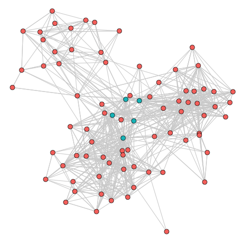
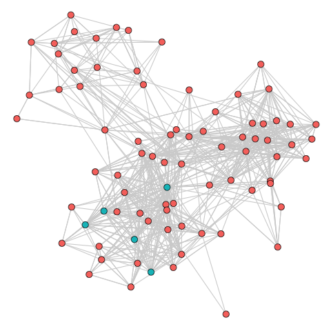
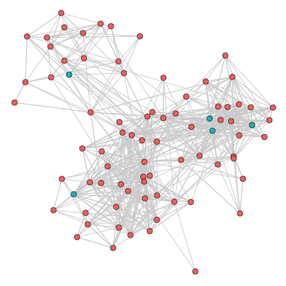

```{r setup, include=FALSE}
knitr::opts_chunk$set(echo = FALSE)
library(diagram)
library(igraph)
library(igraphdata)
library(ggplot2)
library(ggraph)
data("UKfaculty")
```

## Traversal: Relative Orientation

```{r}
pos = coordinates(c(3))
openplotmat()

arrow1 <- straightarrow(pos[1,], pos[2,], lwd = 3)
arrow2 <- straightarrow(pos[2,], pos[3,], lwd = 3)
textellipse(pos[1,], .1, lab = 'Node 1', box.col = '#89cff0',
            shadow.size = .005, cex = 1.5)
textellipse(pos[2,], .1, lab = 'Node 2', box.col = '#89cff0',
            shadow.size = .005, cex = 1.5)
textellipse(pos[3,], .1, lab = "Node 3", box.col = '#89cff0',
            shadow.size = .005, cex = 1.5)
text(arrow1[1],
     arrow1[2],
     "Link 1",
     pos = 3,
     cex = 1.5)
text(arrow2[1],
     arrow2[2],
     "Link 2",
     pos = 3,
     cex = 1.5)
```

## Traversal: Sequential Queries

```{r}
pos <- coordinates(c(3,3,3))
openplotmat()


textellipse(pos[4,], .075, lab = 'Teacher 1', box.col = '#66c2a5',
            shadow.size = .005, cex = 1)

```

## Traversal: Sequential Queries

```{r}
pos <- coordinates(c(3,3,3))
openplotmat()

teaches <- straightarrow(pos[4,], pos[5,], lwd = 3)

textellipse(pos[4,], .075, lab = 'Teacher 1', box.col = '#66c2a5',
            shadow.size = .005, cex = 1)
textellipse(pos[5,], .075, lab = 'Course 1', box.col = '#fc8d62',
            shadow.size = .005, cex = 1)

text(teaches[1],
     teaches[2],
     "Teaches",
     pos = 3,
     cex = 1)
```

## Traversal: Sequential Queries

```{r}
pos <- coordinates(c(3,3,3))
openplotmat()

teaches <- straightarrow(pos[4,], pos[5,], lwd = 3)
attends1 <- straightarrow(pos[3,], pos[5,], lwd = 3)
attends2 <- straightarrow(pos[6,], pos[5,], lwd = 3)
attends3 <- straightarrow(pos[9,], pos[5,], lwd = 3)

textellipse(pos[4,], .075, lab = 'Teacher 1', box.col = '#66c2a5',
            shadow.size = .005, cex = 1)
textellipse(pos[5,], .075, lab = 'Course 1', box.col = '#fc8d62',
            shadow.size = .005, cex = 1)
textellipse(pos[3,], .075, lab = 'Student 1', box.col = '#8da0cb',
            shadow.size = .005, cex = 1)
textellipse(pos[6,], .075, lab = "Student 2", box.col = '#8da0cb',
            shadow.size = .005, cex = 1)
textellipse(pos[9,], .075, lab = "Student 3", box.col = '#8da0cb',
            shadow.size = .005, cex = 1)

text(teaches[1],
     teaches[2],
     "Teaches",
     pos = 3,
     cex = 1)
text(attends1[1],
     attends1[2],
     "Attends",
     pos = 3,
     cex = 1)
text(attends2[1],
     attends2[2],
     "Attends",
     pos = 3,
     cex = 1)
text(attends3[1],
     attends3[2],
     "Attends",
     pos = 3,
     cex = 1)

```

## Traversal: Sequential Queries

```{r}
pos <- coordinates(c(3,3,3,3,3))
openplotmat()

teaches1 <- straightarrow(pos[4,], pos[5,], lwd = 3)
teaches2 <- straightarrow(pos[10,], pos[11,], lwd = 3)
attends1 <- straightarrow(pos[3,], pos[5,], lwd = 3)
attends2 <- straightarrow(pos[6,], pos[5,], lwd = 3)
attends3 <- straightarrow(pos[9,], pos[5,], lwd = 3)
attends4 <- straightarrow(pos[9,], pos[11,], lwd = 3)
attends5 <- straightarrow(pos[12,], pos[11,], lwd = 3)
attends6 <- straightarrow(pos[15,], pos[11,], lwd = 3)

textellipse(pos[4,], .075, lab = 'Teacher 1', box.col = '#66c2a5',
            shadow.size = .005, cex = 1)
textellipse(pos[10,], .075, lab = 'Teacher 2', box.col = '#66c2a5',
            shadow.size = .005, cex = 1)
textellipse(pos[5,], .075, lab = 'Course 1', box.col = '#fc8d62',
            shadow.size = .005, cex = 1)
textellipse(pos[11,], .075, lab = 'Course 2', box.col = '#fc8d62',
            shadow.size = .005, cex = 1)
textellipse(pos[3,], .075, lab = 'Student 1', box.col = '#8da0cb',
            shadow.size = .005, cex = 1)
textellipse(pos[6,], .075, lab = "Student 2", box.col = '#8da0cb',
            shadow.size = .005, cex = 1)
textellipse(pos[9,], .075, lab = "Student 3", box.col = '#8da0cb',
            shadow.size = .005, cex = 1)
textellipse(pos[12,], .075, lab = "Student 4", box.col = '#8da0cb',
            shadow.size = .005, cex = 1)
textellipse(pos[15,], .075, lab = "Student 5", box.col = '#8da0cb',
            shadow.size = .005, cex = 1)

text(teaches1[1],
     teaches1[2],
     "Teaches",
     pos = 3,
     cex = 1)
text(teaches2[1],
     teaches2[2],
     "Teaches",
     pos = 3,
     cex = 1)
text(attends1[1],
     attends1[2],
     "Attends",
     pos = 3,
     cex = 1)
text(attends2[1],
     attends2[2],
     "Attends",
     pos = 3,
     cex = 1)
text(attends3[1],
     attends3[2],
     "Attends",
     pos = 3,
     cex = 1)
text(attends4[1],
     attends4[2],
     "Attends",
     pos = 3,
     cex = 1)
text(attends5[1],
     attends5[2],
     "Attends",
     pos = 3,
     cex = 1)
text(attends6[1],
     attends6[2],
     "Attends",
     pos = 3,
     cex = 1)

```

## Traversal: Sequential Queries

```{r}
pos <- coordinates(c(3,3,3,3,3))
openplotmat()

teaches1 <- straightarrow(pos[4,], pos[5,], lwd = 3)
teaches2 <- straightarrow(pos[10,], pos[11,], lwd = 3)
attends1 <- straightarrow(pos[3,], pos[5,], lwd = 3)
attends2 <- straightarrow(pos[6,], pos[5,], lwd = 3)
attends3 <- straightarrow(pos[9,], pos[5,], lwd = 3)
attends4 <- straightarrow(pos[9,], pos[11,], lwd = 3)
attends5 <- straightarrow(pos[12,], pos[11,], lwd = 3)
attends6 <- straightarrow(pos[15,], pos[11,], lwd = 3)

textellipse(pos[4,], .075, lab = 'Teacher 1', box.col = '#66c2a5',
            shadow.size = .005, cex = 1)
textellipse(pos[10,], .075, lab = 'Teacher 2', box.col = '#66c2a5',
            shadow.size = .005, cex = 1)
textellipse(pos[5,], .075, lab = 'Course 1', box.col = '#fc8d62',
            shadow.size = .005, cex = 1)
textellipse(pos[11,], .075, lab = 'Course 2', box.col = '#fc8d62',
            shadow.size = .005, cex = 1)
textellipse(pos[3,], .075, lab = 'Student 1', box.col = '#8da0cb',
            shadow.size = .005, cex = 1)
textellipse(pos[6,], .075, lab = "Student 2", box.col = '#8da0cb',
            shadow.size = .005, cex = 1)
textellipse(pos[9,], .075, lab = "Student 3", box.col = 'gold',
            shadow.size = .005, cex = 1)
textellipse(pos[12,], .075, lab = "Student 4", box.col = '#8da0cb',
            shadow.size = .005, cex = 1)
textellipse(pos[15,], .075, lab = "Student 5", box.col = '#8da0cb',
            shadow.size = .005, cex = 1)

text(teaches1[1],
     teaches1[2],
     "Teaches",
     pos = 3,
     cex = 1)
text(teaches2[1],
     teaches2[2],
     "Teaches",
     pos = 3,
     cex = 1)
text(attends1[1],
     attends1[2],
     "Attends",
     pos = 3,
     cex = 1)
text(attends2[1],
     attends2[2],
     "Attends",
     pos = 3,
     cex = 1)
text(attends3[1],
     attends3[2],
     "Attends",
     pos = 3,
     cex = 1)
text(attends4[1],
     attends4[2],
     "Attends",
     pos = 3,
     cex = 1)
text(attends5[1],
     attends5[2],
     "Attends",
     pos = 3,
     cex = 1)
text(attends6[1],
     attends6[2],
     "Attends",
     pos = 3,
     cex = 1)

```


## Traversal: Sequential Queries

```{r}
pos <- coordinates(c(3,3,3,3,3))
openplotmat()

teaches1 <- straightarrow(pos[4,], pos[5,], lwd = 3)
teaches2 <- straightarrow(pos[10,], pos[11,], lwd = 3)
attends1 <- straightarrow(pos[3,], pos[5,], lwd = 3)
attends2 <- straightarrow(pos[6,], pos[5,], lwd = 3)
attends3 <- straightarrow(pos[9,], pos[5,], lwd = 3)
attends4 <- straightarrow(pos[9,], pos[11,], lwd = 3)
attends5 <- straightarrow(pos[12,], pos[11,], lwd = 3)
attends6 <- straightarrow(pos[15,], pos[11,], lwd = 3)

textellipse(pos[4,], .075, lab = 'Teacher 1', box.col = '#66c2a5',
            shadow.size = .005, cex = 1)
textellipse(pos[10,], .075, lab = 'Teacher 2', box.col = '#66c2a5',
            shadow.size = .005, cex = 1)
textellipse(pos[5,], .075, lab = 'Biology 101', box.col = '#fc8d62',
            shadow.size = .005, cex = 1)
textellipse(pos[11,], .075, lab = 'Physics 101', box.col = '#fc8d62',
            shadow.size = .005, cex = 1)
textellipse(pos[3,], .075, lab = 'Envir. Studies\nMajor', box.col = '#8da0cb',
            shadow.size = .005, cex = 1)
textellipse(pos[6,], .075, lab = "Biology\nMajor", box.col = '#8da0cb',
            shadow.size = .005, cex = 1)
textellipse(pos[9,], .075, lab = "PreMed\nMajor", box.col = 'gold',
            shadow.size = .005, cex = 1)
textellipse(pos[12,], .075, lab = "Engineering\nMajor", box.col = '#8da0cb',
            shadow.size = .005, cex = 1)
textellipse(pos[15,], .075, lab = "Physics\nMajor", box.col = '#8da0cb',
            shadow.size = .005, cex = 1)

text(teaches1[1],
     teaches1[2],
     "Teaches",
     pos = 3,
     cex = 1)
text(teaches2[1],
     teaches2[2],
     "Teaches",
     pos = 3,
     cex = 1)
text(attends1[1],
     attends1[2],
     "Attends",
     pos = 3,
     cex = 1)
text(attends2[1],
     attends2[2],
     "Attends",
     pos = 3,
     cex = 1)
text(attends3[1],
     attends3[2],
     "Attends",
     pos = 3,
     cex = 1)
text(attends4[1],
     attends4[2],
     "Attends",
     pos = 3,
     cex = 1)
text(attends5[1],
     attends5[2],
     "Attends",
     pos = 3,
     cex = 1)
text(attends6[1],
     attends6[2],
     "Attends",
     pos = 3,
     cex = 1)

```


## Degree

```{r}
#
V(UKfaculty)$dgr <- degree(UKfaculty)
V(UKfaculty)$dgr_color <- V(UKfaculty)$dgr %>%
  sapply(function(x){
    pct <- (length(.)-5)/length(.)
    pct <- quantile(., pct)
    x >= pct
  })

set.seed(1234)
ggraph(UKfaculty, layout = 'drl' ) +
  geom_edge_link(colour = 'lightgrey') +
  geom_node_point(aes(fill = dgr_color,
                      size = dgr), shape = 21) +
  theme_void() +
  theme(legend.position = 'none')
```

**Degree:** The number of edges connected to a node

## Strength

```{r}
V(UKfaculty)$str <- strength(UKfaculty)
V(UKfaculty)$str_color <- V(UKfaculty)$str %>%
  sapply(function(x){
    pct <- (length(.)-5)/length(.)
    pct <- quantile(., pct)
    x >= pct
  })

set.seed(1234)
ggraph(UKfaculty, layout = 'drl' ) +
  geom_edge_link(colour = 'lightgrey') +
  geom_node_point(aes(fill = str_color,
                      size = str), shape = 21) +
  theme_void() +
  theme(legend.position = 'none')
```

**Strength:** The cummulative weight of all the edges connected to a node

## Shortest Paths

```{r}
sp <- UKfaculty %>%
  farthest_vertices(weights = NA) %>%
  .$vertices %>%
  {
    shortest_paths(UKfaculty, .[1], .[2], 'out', output = 'both')
  }

V(UKfaculty)$inDiam <- V(UKfaculty) %in% sp$vpath[[1]]
E(UKfaculty)$inDiam <- E(UKfaculty) %in% sp$epath[[1]]

set.seed(1234)
ggraph(UKfaculty, layout = 'drl' ) +
  geom_edge_link(aes(colour = inDiam,
                     edge_width = inDiam),
                 alpha = .5) +
  geom_node_point(aes(fill = inDiam), size = 4, shape = 21) +
  theme_void() +
  scale_edge_colour_manual(values = c('lightgrey', 'black')) +
  scale_edge_width_manual(values = c(.5, 2)) +
  theme(legend.position = 'none')

```

## Betweeness

```{r}
#
V(UKfaculty)$btw <- betweenness(UKfaculty)

V(UKfaculty)$btw_color <- V(UKfaculty)$btw %>%
  sapply(function(x){
    pct <- (length(.)-5)/length(.)
    pct <- quantile(., pct)
    x >= pct
  })

set.seed(1234)
ggraph(UKfaculty, layout = 'drl' ) +
  geom_edge_link(colour = 'lightgrey') +
  geom_node_point(aes(fill = btw_color,
                      size = btw), shape = 21) +
  theme_void() +
  theme(legend.position = 'none')
```

**Betweeness:** Defined by the number of shortest paths going through an edge

## Closeness

```{r, warning=F}
#
V(UKfaculty)$cls <- closeness(UKfaculty)
V(UKfaculty)$cls_color <- V(UKfaculty)$cls  %>%
  sapply(function(x){
    pct <- (length(.)-5)/length(.)
    pct <- quantile(., pct)
    x >= pct
  })


set.seed(1234)
ggraph(UKfaculty, layout = 'drl' ) +
  geom_edge_link(colour = 'lightgrey') +
  geom_node_point(aes(fill = cls_color,
                      size = cls), shape = 21) +
  theme_void() +
  theme(legend.position = 'none')
```

**Closeness:** Defined by the number of steps required to access every other vertex from a given vertex

## Eigenvector Centrality

```{r, warning=F}
V(UKfaculty)$ec <- eigen_centrality(UKfaculty, directed = T)$vector
V(UKfaculty)$ec_color <- V(UKfaculty)$ec  %>%
  sapply(function(x){
    pct <- (length(.)-5)/length(.)
    pct <- quantile(., pct)
    x >= pct
  })


set.seed(1234)
ggraph(UKfaculty, layout = 'drl' ) +
  geom_edge_link(colour = 'lightgrey') +
  geom_node_point(aes(fill = ec_color,
                      size = ec), shape = 21)  +
  theme_void() +
  theme(legend.position = 'none')

```

## Hub Score

```{r}
#
V(UKfaculty)$hub <- hub_score(UKfaculty)$vector
V(UKfaculty)$hub_color <- V(UKfaculty)$hub  %>%
  sapply(function(x){
    pct <- (length(.)-5)/length(.)
    pct <- quantile(., pct)
    x >= pct
  })


set.seed(1234)
ggraph(UKfaculty, layout = 'drl' ) +
  geom_edge_link(colour = 'lightgrey') +
  geom_node_point(aes(fill = hub_color,
                      size = hub), shape = 21)  +
  theme_void() +
  theme(legend.position = 'none')
```

**Hub Score:** Defined by the number of Authorities the node points to

## Authority Score


```{r}
#
V(UKfaculty)$auth <- authority_score(UKfaculty)$vector
V(UKfaculty)$auth_color <- V(UKfaculty)$auth  %>%
  sapply(function(x){
    pct <- (length(.)-5)/length(.)
    pct <- quantile(., pct)
    x >= pct
  })

set.seed(1234)
ggraph(UKfaculty, layout = 'drl' ) +
  geom_edge_link(colour = 'lightgrey') +
  geom_node_point(aes(fill = auth_color,
                      size = auth), shape = 21) +
  theme_void() +
  theme(legend.position = 'none')
```

**Authority Score:** Defined by the number of Hubs pointing to the node

## Page Rank

```{r}
#
V(UKfaculty)$pr <- page_rank(UKfaculty)$vector
V(UKfaculty)$pr_color <- V(UKfaculty)$pr %>%
  sapply(function(x){
    pct <- (length(.)-5)/length(.)
    pct <- quantile(., pct)
    x >= pct
  })

set.seed(1234)
ggraph(UKfaculty, layout = 'drl' ) +
  geom_edge_link(colour = 'lightgrey') +
  geom_node_point(aes(fill = pr_color,
                      size = pr), shape = 21) +
  theme_void() +
  theme(legend.position = 'none')
```

Google interprets a link from page A to page B as a vote, by page A, for page B ... Votes cast by pages that are themselves ‘important’ weigh more heavily and help to make other pages ‘important.’ 