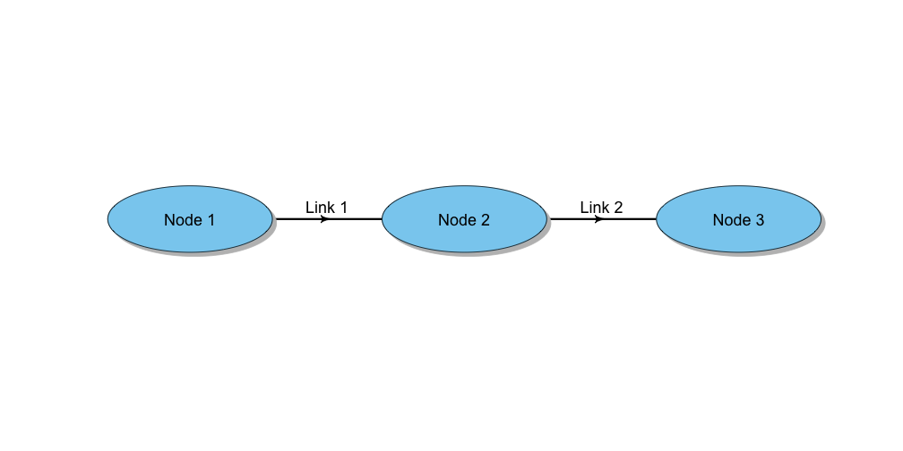
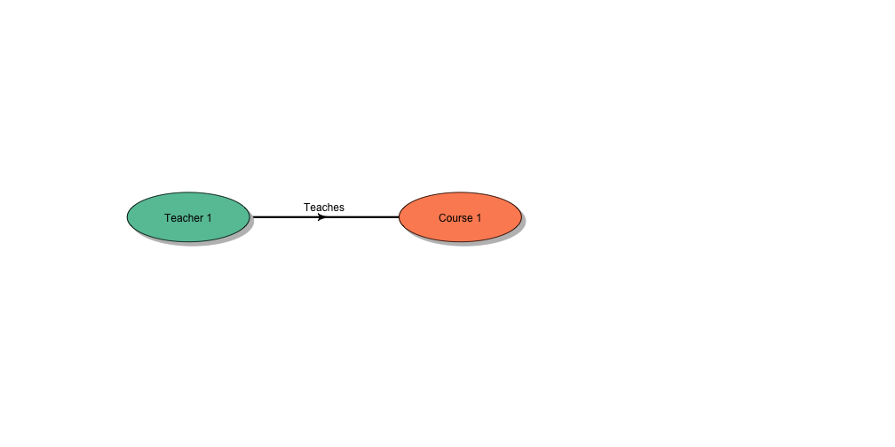
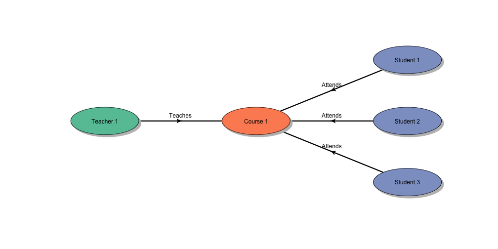
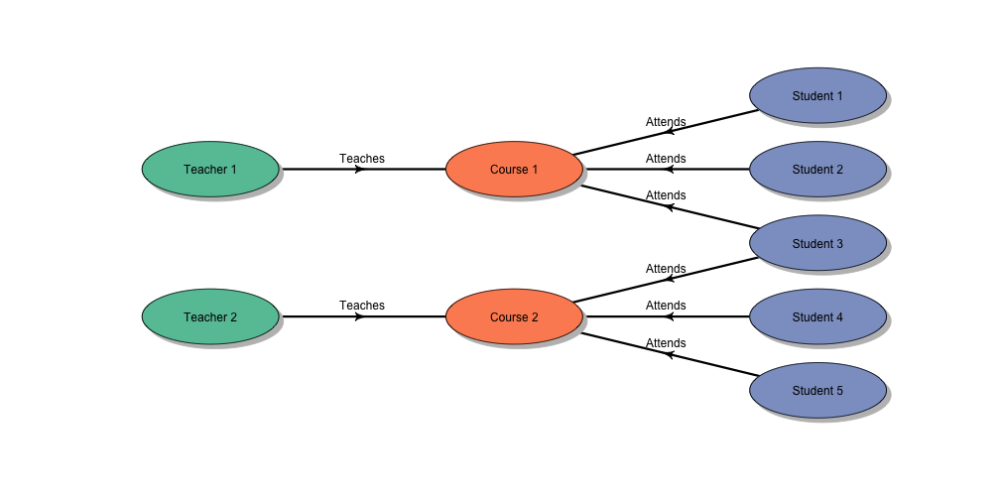
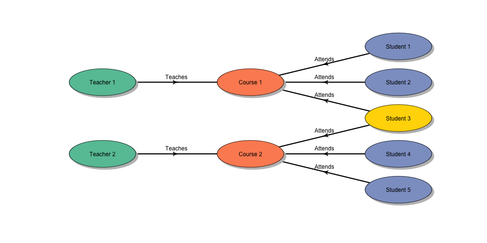
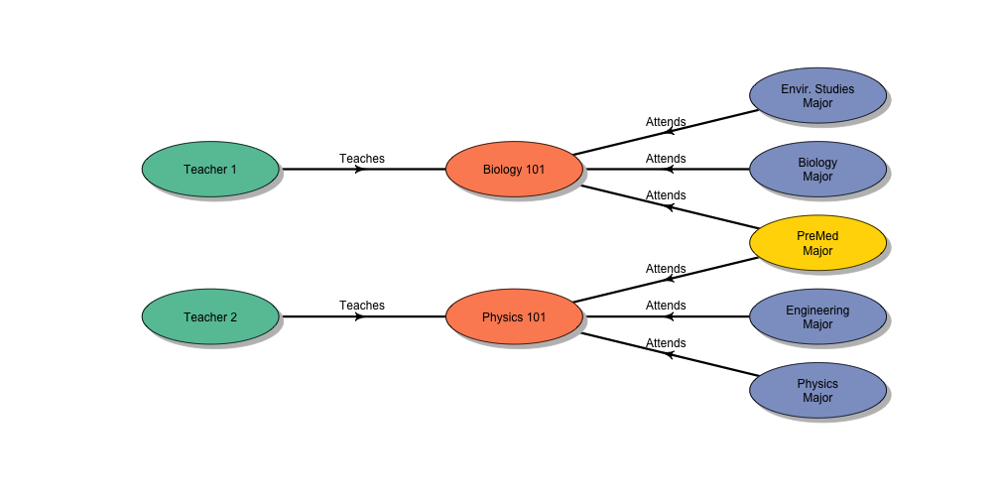
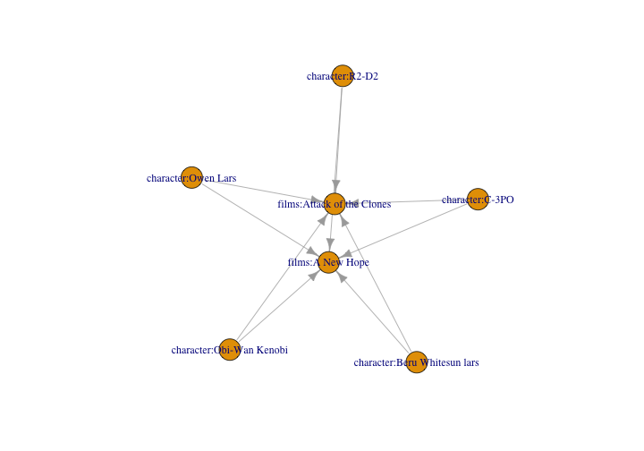
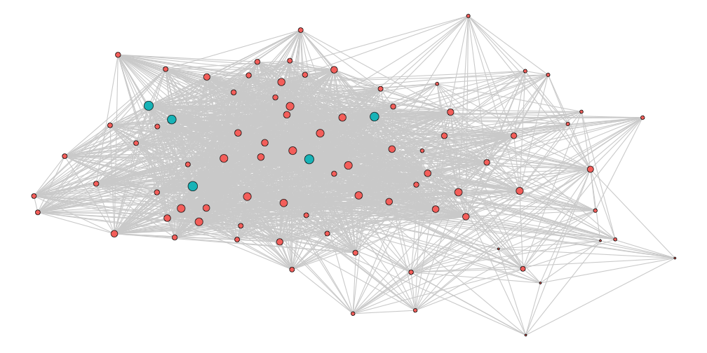
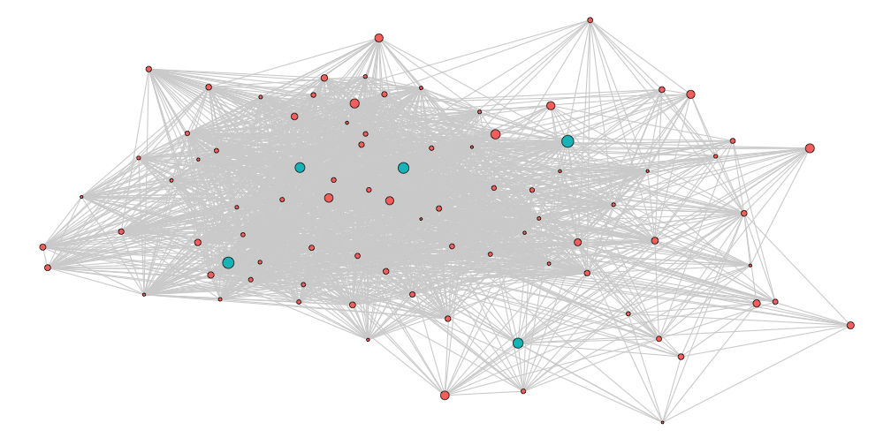

Traversal Functions
========================================================
author: 
date: 
autosize: true
<style>
.small-code pre code {
  font-size: 1em;
}
</style>


Traversal: Relative Orientation
===


Traversal: Sequential Queries
====


Traversal: Sequential Queries
====


Traversal: Sequential Queries
====


Traversal: Sequential Queries
=====


Traversal: Sequential Queries
====



Traversal: Sequential Queries
====


Ends of Edges
=====
class:small-code

```r
character_film <- E(starwars_g)[type == 'films']

tail_of(starwars_g, character_film) %>%
  head()
```

```
+ 6/253 vertices, named, from 718f4b4:
[1] character:Luke Skywalker character:Luke Skywalker
[3] character:Luke Skywalker character:Luke Skywalker
[5] character:Luke Skywalker character:C-3PO         
```

```r
head_of(starwars_g, character_film) %>% 
  head()
```

```
+ 6/253 vertices, named, from 718f4b4:
[1] films:Revenge of the Sith     films:Return of the Jedi     
[3] films:The Empire Strikes Back films:A New Hope             
[5] films:The Force Awakens       films:Attack of the Clones   
```

```r
ends(starwars_g, character_film) %>%
  .[1:5,]
```

```
     [,1]                       [,2]                           
[1,] "character:Luke Skywalker" "films:Revenge of the Sith"    
[2,] "character:Luke Skywalker" "films:Return of the Jedi"     
[3,] "character:Luke Skywalker" "films:The Empire Strikes Back"
[4,] "character:Luke Skywalker" "films:A New Hope"             
[5,] "character:Luke Skywalker" "films:The Force Awakens"      
```

Who Was in A New Hope and Attack of the Clones
=====
class:small-code

```r
starwars_g %>%
  {V(.)[str_detect(name, 'A New Hope')]} %>%
  {E(starwars_g)[V(starwars_g)[type == 'character'] %--% .]} %>%
  tail_of(starwars_g, .) %>%
  {E(starwars_g)[V(starwars_g)[str_detect(name, 'Attack of the Clones')] %--% .]} 
```

```
+ 5/2531 edges from 718f4b4 (vertex names):
[1] character:C-3PO             ->films:Attack of the Clones
[2] character:R2-D2             ->films:Attack of the Clones
[3] character:Owen Lars         ->films:Attack of the Clones
[4] character:Beru Whitesun lars->films:Attack of the Clones
[5] character:Obi-Wan Kenobi    ->films:Attack of the Clones
```

Who Was in A New Hope and Attack of the Clones?
=====
class:small-code

```r
starwars_g %>%
  {V(.)[str_detect(name, 'A New Hope')]} %>%
  {E(starwars_g)[V(starwars_g)[type == 'character'] %--% .]} %>%
  tail_of(starwars_g, .) %>%
  {E(starwars_g)[V(starwars_g)[str_detect(name, 'Attack of the Clones')] %--% .]} %>%
  {c(., E(starwars_g)[tail_of(starwars_g, .) %--% V(starwars_g)[str_detect(name, 'A New Hope')]])} %>%
  subgraph.edges(starwars_g, .) %>%
  plot()
```




Summary Statistics
====
class:small-code

```r
starwars_char <- starwars_g %>%
  {. - V(.)[type != 'character']} %>%
  {. - E(.)[is.na(movies_shared)]} 

starwars_char
```

```
IGRAPH e206477 DN-B 87 1793 -- 
+ attr: name (v/c), type (v/c), height (v/n), mass (v/n),
| birth_year (v/n), id (v/c), type (e/c), movies_shared (e/n)
+ edges from e206477 (vertex names):
[1] character:C-3PO         ->character:Obi-Wan Kenobi
[2] character:C-3PO         ->character:R2-D2         
[3] character:Obi-Wan Kenobi->character:R2-D2         
[4] character:C-3PO         ->character:Palpatine     
[5] character:C-3PO         ->character:Yoda          
[6] character:Chewbacca     ->character:Leia Organa   
[7] character:Chewbacca     ->character:Luke Skywalker
+ ... omitted several edges
```

Degree
====


**Degree:** The number of edges connected to a node

Degree
=====
class:small-code

```r
degree(starwars_char) %>%
  sort(decreasing = T) %>%
  head
```

```
           character:R2-D2   character:Obi-Wan Kenobi 
                        86                         81 
           character:C-3PO             character:Yoda 
                        81                         77 
       character:Palpatine character:Anakin Skywalker 
                        77                         65 
```

Strength
===


**Strength:** The cummulative weight of all the edges connected to a node

Strength
=====
class:small-code

```r
starwars_char %>%
  strength(., weights = E(.)$movies_shared) %>%
  sort(decreasing = T) %>%
  head
```

```
           character:R2-D2   character:Obi-Wan Kenobi 
                       166                        156 
           character:C-3PO             character:Yoda 
                       156                        139 
       character:Palpatine character:Anakin Skywalker 
                       139                        105 
```

Shortest Paths
====


Shortest Paths
=====
class:small-code

```r
starwars_char %>%
  farthest_vertices(weights = NA) %>%
  .$vertices 
```

```
+ 2/87 vertices, named, from e206477:
[1] character:Cordé            character:Jek Tono Porkins
```

```r
starwars_char %>%
  farthest_vertices(weights = NA) %>%
  .$vertices %>%
  {
    shortest_paths(starwars_char, .[1], .[2], 'out', output = 'both')
  }
```

```
$vpath
$vpath[[1]]
+ 5/87 vertices, named, from e206477:
[1] character:Cordé                 character:Dooku                
[3] character:Eeth Koth             character:Jabba Desilijic Tiure
[5] character:Jek Tono Porkins     


$epath
$epath[[1]]
+ 4/1793 edges from e206477 (vertex names):
[1] character:Cordé                ->character:Dooku                
[2] character:Dooku                ->character:Eeth Koth            
[3] character:Eeth Koth            ->character:Jabba Desilijic Tiure
[4] character:Jabba Desilijic Tiure->character:Jek Tono Porkins     


$predecessors
NULL

$inbound_edges
NULL
```

Betweeness
====


**Betweeness:** Defined by the number of shortest paths going through an edge

Betweeness
=====
class:small-code

```r
starwars_char %>%
  betweenness(., directed = F) %>%
  sort(decreasing = T) %>%
  head
```

```
         character:R2-D2 character:Obi-Wan Kenobi          character:C-3PO 
               358.08590                159.16923                159.16923 
          character:Yoda      character:Palpatine character:Luke Skywalker 
               120.76144                120.76144                 90.69074 
```

Closeness
====


**Closeness:** Defined by the number of steps required to access every other vertex from a given vertex

Closeness
=====
class:small-code

```r
starwars_char %>%
  closeness(., mode = 'all') %>%
  sort(decreasing = T) %>%
  head
```

```
           character:R2-D2   character:Obi-Wan Kenobi 
               0.011627907                0.010989011 
           character:C-3PO             character:Yoda 
               0.010989011                0.010526316 
       character:Palpatine character:Anakin Skywalker 
               0.010526316                0.009345794 
```

UKFACULTY
====
class:small-code

```r
library(igraphdata)
data(UKfaculty)
UKfaculty
```

```
IGRAPH 6f42903 D-W- 81 817 -- 
+ attr: Type (g/c), Date (g/c), Citation (g/c), Author (g/c),
| Group (v/n), weight (e/n)
+ edges from 6f42903:
 [1] 57->52 76->42 12->69 43->34 28->47 58->51  7->29 40->71  5->37 48->55
[11]  6->58 21-> 8 28->69 43->21 67->58 65->42  5->67 52->75 37->64  4->36
[21] 12->49 19->46 37-> 9 74->36 62-> 1 15-> 2 72->49 46->62  2->29 40->12
[31] 22->29 71->69  4-> 3 37->69  5-> 6 77->13 23->49 52->35 20->14 62->70
[41] 34->35 76->72  7->42 37->42 51->80 38->45 62->64 36->53 62->77 17->61
[51]  7->68 46->29 44->53 18->58 12->16 72->42 52->32 58->21 38->17 15->51
[61] 22-> 7 22->69  5->13 29-> 2 77->12 37->35 18->46 10->71 22->47 20->19
+ ... omitted several edges
```

Eigenvector Centrality
====


Eigen Centrality
====
class:small-code

```r
eigen_centrality(UKfaculty, directed = T)$vector 
```

```
 [1] 0.0098045990 0.6213028360 0.0006705506 0.0232971739 0.0780384986
 [6] 0.1301253052 0.3297407198 0.3058305057 0.0136278434 0.2658194160
[11] 0.0090988319 0.1522779611 0.1720293194 0.0994582649 0.1194715840
[16] 0.1059101593 0.0024159663 0.3873773887 0.3927669322 0.1342428500
[21] 0.8598447828 0.1360703317 0.2334120001 0.0421600322 0.0919029986
[26] 0.1449678024 0.3158495467 0.0368164438 0.8146025177 0.0324962328
[31] 1.0000000000 0.0602626273 0.1039451002 0.2180731819 0.8254900029
[36] 0.0031571589 0.1625849446 0.0578958791 0.2890500355 0.0644005941
[41] 0.3466600054 0.2105152917 0.3164187296 0.0002735305 0.0035279229
[46] 0.4571373209 0.0959006576 0.0276648254 0.1983955495 0.3786776189
[51] 0.2460984672 0.1264810988 0.0095221615 0.3282926121 0.0314789736
[56] 0.1045419854 0.2040432435 0.1951510798 0.0087960227 0.0096127687
[61] 0.0089355822 0.2077932437 0.1163731686 0.0484683825 0.0432959851
[66] 0.0483776439 0.0201739720 0.1575337838 0.4325800155 0.2004228422
[71] 0.0688756080 0.0568947878 0.0025480208 0.0176262562 0.0522455162
[76] 0.1013233252 0.3198863908 0.0034073907 0.7915700482 0.1277773841
[81] 0.0055728275
```
 
Authority Score
=====


**Authority Score:** Defined by the number of Hubs pointing to the node

Authority Score
=====
class:small-code

```r
authority_score(UKfaculty)$vector
```

```
 [1] 0.0161663722 0.6349021372 0.0013513537 0.0296421381 0.0924236166
 [6] 0.1387880706 0.4207020887 0.2302305939 0.0342361014 0.2073234852
[11] 0.0076017198 0.1230122562 0.1588151537 0.1264706329 0.1161331513
[16] 0.1220348071 0.0014113458 0.4398444537 0.5004886650 0.1558500156
[21] 0.9086894692 0.1830886414 0.1680996153 0.0558057088 0.0877040625
[26] 0.1699347114 0.3420749804 0.0313424886 0.8235751667 0.0272709594
[31] 1.0000000000 0.0814998805 0.1229138139 0.3075763231 0.7727795107
[36] 0.0045359030 0.1706565637 0.1189391445 0.3704275934 0.0624398400
[41] 0.2605258151 0.1828489031 0.4436567100 0.0002561973 0.0036486738
[46] 0.4434814007 0.0639311844 0.0465329432 0.1853731880 0.4193040178
[51] 0.2664976011 0.1895595901 0.0075827726 0.4492974742 0.0512327299
[56] 0.1275498484 0.3046128455 0.2004648001 0.0097845920 0.0147268245
[61] 0.0132420180 0.3054946705 0.0793134817 0.0925037762 0.0340305341
[66] 0.0530961663 0.0331113122 0.1410041950 0.4714911023 0.2619526856
[71] 0.0713579557 0.0448742270 0.0030870768 0.0195769719 0.0881007910
[76] 0.0810435433 0.2909753431 0.0023772996 0.7607747624 0.1682823156
[81] 0.0122476050
```

Hub Score
====


**Hub Score:** Defined by the number of Authorities the node points to

Hub Score
====
class:small-code

```r
hub_score(UKfaculty)$vector
```

```
 [1] 6.887203e-03 2.662922e-01 7.219570e-04 1.211132e-02 1.353997e-01
 [6] 9.699797e-02 1.678190e-01 8.580034e-02 2.070812e-03 1.621586e-01
[11] 9.439286e-18 4.977444e-02 1.770319e-01 9.271242e-02 2.432888e-01
[16] 4.141193e-02 2.697534e-02 1.631371e-01 4.408448e-01 1.155500e-01
[21] 5.102403e-01 6.963563e-02 1.494704e-01 1.911418e-02 3.348656e-02
[26] 1.656578e-01 1.257490e-01 4.971134e-02 1.000000e+00 2.235947e-02
[31] 5.521663e-01 5.697799e-03 9.673778e-02 1.296769e-01 3.694211e-01
[36] 2.261244e-03 4.077134e-01 3.092455e-02 2.787511e-01 4.780470e-02
[41] 9.372960e-02 1.087205e-01 3.349995e-01 3.751686e-03 1.182668e-03
[46] 3.346262e-01 3.347173e-02 3.781545e-02 9.574247e-02 1.929435e-01
[51] 2.481907e-01 1.808613e-01 1.499191e-03 4.398203e-02 1.218257e-02
[56] 4.184320e-02 2.103158e-01 7.407898e-02 4.648626e-04 2.330352e-03
[61] 7.447501e-03 2.826543e-01 5.279343e-02 3.085880e-02 6.639476e-03
[66] 1.066482e-02 4.984016e-03 1.287544e-01 1.401257e-01 9.575113e-02
[71] 4.622949e-02 7.750779e-02 3.066034e-03 2.182572e-02 2.758490e-02
[76] 6.088500e-02 1.219781e-01 3.036437e-03 3.711051e-01 6.444581e-02
[81] 8.677255e-03
```

Page Rank
====


Google interprets a link from page A to page B as a vote, by page A, for page B ... Votes cast by pages that are themselves ‘important’ weigh more heavily.

Page Rank
=====
class:small-code

```r
page_rank(UKfaculty)$vector
```

```
 [1] 0.008937130 0.019316075 0.004012504 0.014529515 0.010326041
 [6] 0.010684184 0.020520969 0.010197973 0.008710961 0.027400060
[11] 0.002524551 0.014491063 0.017193571 0.008471565 0.005037843
[16] 0.013554200 0.010069672 0.012892478 0.010097627 0.011736378
[21] 0.025035491 0.008398913 0.016175418 0.013380932 0.004697012
[26] 0.011409578 0.019568175 0.007194725 0.023676378 0.005594413
[31] 0.029683590 0.011820071 0.013932940 0.004628710 0.019685227
[36] 0.011333953 0.011823253 0.009788216 0.007745092 0.009541182
[41] 0.011762165 0.022757708 0.009548549 0.002568940 0.013606941
[46] 0.014694729 0.011858777 0.005776853 0.019387008 0.025497183
[51] 0.008442859 0.008461327 0.010663190 0.019977488 0.004700903
[56] 0.009221155 0.006881705 0.012107003 0.011239961 0.007417787
[61] 0.014609445 0.013228838 0.009809895 0.007100084 0.005562999
[66] 0.006729677 0.003341391 0.013168276 0.026040823 0.010255323
[71] 0.006135363 0.007256894 0.006911580 0.014537858 0.026115242
[76] 0.011698342 0.030504074 0.005038807 0.016684495 0.008876606
[81] 0.014004126
```
