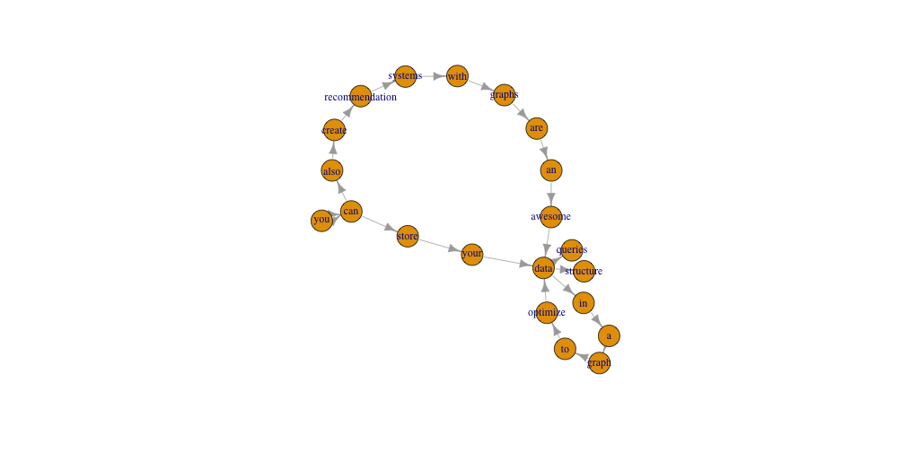
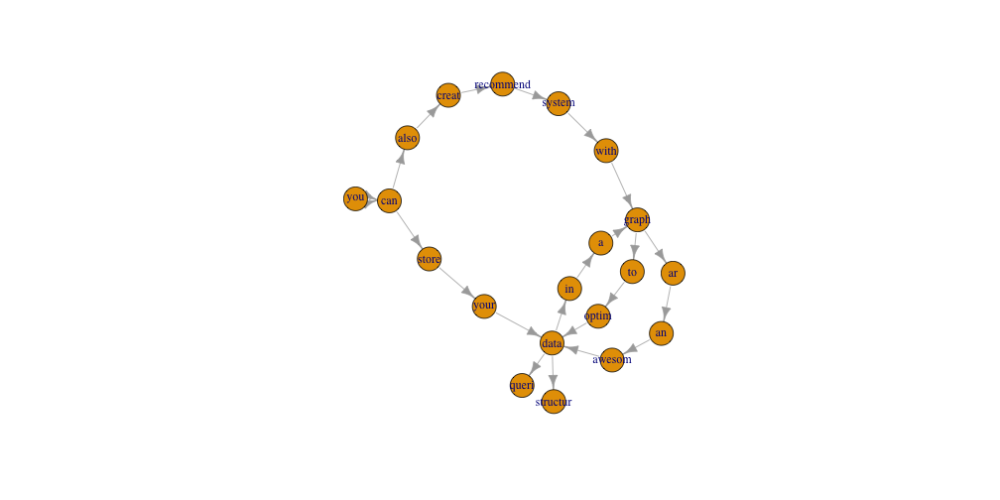
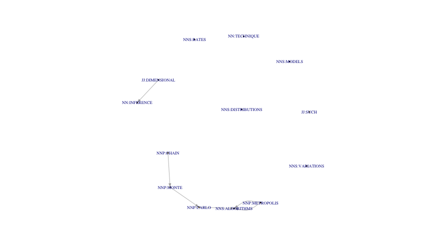
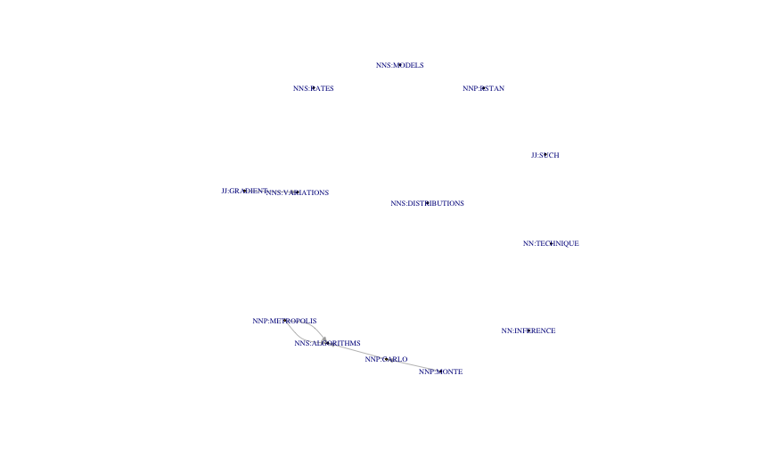

NLP - TEXT RANK
========================================================
author: 
date: 
autosize: true
<style>
.small-code pre code {
  font-size: 1em;
}
</style>

Concept - Language As Graph
========================================================
- Words are nodes
- Proximity are relationships
- "You can judge a word by the company it keeps"

Example
========================================================

"Graphs are an awesome data structure. You can store your data in a graph to optimize data queries. You can also create recommendation systems with graphs."


Graph Example
==========
class:small-code

```r
library(tidyverse)
library(SnowballC)
library(igraph)

text_df <- example_text %>%
  str_split('\\.') %>%
  unlist() %>%
  str_trim() %>%
  str_to_lower() %>%
  str_split(' ') %>%
  map(function(x){
    tibble(from = x[1:(length(x)-1)],
           to = x[2:length(x)],
           next_id = 1:(length(x)-1))
  }) %>%
  enframe(name = 'sentence_id') %>%
  unnest() %>%
  filter() %>%
  select(from, to, sentence_id, next_id) %>%
  filter(to != '',
         from != '')
```

Graph Example
=====

```r
text_df
```

```
# A tibble: 23 x 4
   from    to        sentence_id next_id
   <chr>   <chr>           <int>   <int>
 1 graphs  are                 1       1
 2 are     an                  1       2
 3 an      awesome             1       3
 4 awesome data                1       4
 5 data    structure           1       5
 6 you     can                 2       1
 7 can     store               2       2
 8 store   your                2       3
 9 your    data                2       4
10 data    in                  2       5
# ... with 13 more rows
```

Graph Example
=====

```r
text_df %>%
  graph_from_data_frame() %>%
  plot()
```



Stem Example
====

```r
text_df %>%
  mutate(from = wordStem(from),
         to = wordStem(to)) %>%
  graph_from_data_frame() %>%
  plot()
```



Text Rank
=====
Let's pull keyphrases from the 2016 useR Abstract Book

1. only keep words that are adjectives and nouns
2. link two words together if they are within n (2) word spaces from eachother
3. get the page rank of the word graph
4. Keep top 1/3 words
5. if any of the top 1/3 words are adjacent, then they produce a key phrase


Annotating Text - Part of Speech - NLP
====
class:small-code

```r
library(openNLP)
library(NLP)

sent_token_annotator <- Maxent_Sent_Token_Annotator()
word_token_annotator <- Maxent_Word_Token_Annotator()
pos_tag_annotator <- Maxent_POS_Tag_Annotator()

annotated_example <- example_text %>%
  as.String() %>%
  annotate(list(sent_token_annotator,
                word_token_annotator,
                pos_tag_annotator)) %>%
  {
    annotations_in_spans(subset(., type == 'word'),
                         subset(., type == 'sentence'))
  }
```

Annotating Text - Part of Speech - NLP
=====
class:small-code

```r
annotated_example
```

```
[[1]]
 id type start end features
  4 word     1   6 POS=NNS
  5 word     8  10 POS=VBP
  6 word    12  13 POS=DT
  7 word    15  21 POS=JJ
  8 word    23  26 POS=NN
  9 word    28  36 POS=NN
 10 word    37  37 POS=.

[[2]]
 id type start end features
 11 word    39  41 POS=PRP
 12 word    43  45 POS=MD
 13 word    47  51 POS=VB
 14 word    53  56 POS=PRP$
 15 word    58  61 POS=NNS
 16 word    63  64 POS=IN
 17 word    66  66 POS=DT
 18 word    68  72 POS=NN
 19 word    74  75 POS=TO
 20 word    77  84 POS=VB
 21 word    86  89 POS=NNS
 22 word    91  97 POS=NNS
 23 word    98  98 POS=.

[[3]]
 id type start end features
 24 word   100 102 POS=PRP
 25 word   104 106 POS=MD
 26 word   108 111 POS=RB
 27 word   113 118 POS=VB
 28 word   120 133 POS=NN
 29 word   135 141 POS=NNS
 30 word   143 146 POS=IN
 31 word   148 153 POS=NNS
 32 word   154 154 POS=.
```

Annotating Text - Partof Speech - NLP
===
class:small-code

```r
example_text %>%
  as.String() %>%
  .[annotated_example]
```

```
[[1]]
[1] "Graphs"    "are"       "an"        "awesome"   "data"      "structure"
[7] "."        

[[2]]
 [1] "You"      "can"      "store"    "your"     "data"     "in"      
 [7] "a"        "graph"    "to"       "optimize" "data"     "queries" 
[13] "."       

[[3]]
[1] "You"            "can"            "also"           "create"        
[5] "recommendation" "systems"        "with"           "graphs"        
[9] "."             
```

Abstract Graph
=====
class:small-code


```r
summary(g2016)
```

```
IGRAPH 16cd4c4 DN-- 1580 1635 -- 
+ attr: name (v/c), nodeType (v/c), pageBody (v/c), abstractType
| (v/c), id (v/c), abstract (v/c), type (e/c)
```

```r
g2016 %>% V %>% .[nodeType == 'ABSTRACT'] %>% .$pageBody %>% .[2]
```

```
[1] "DiLeMMa - Distributed Learning with Markov Chain Monte Carlo Algorithms with the ROAR Package Ali Mehdi Zaidi Microsoft Abstract: Markov Chain Monte Carlo algorithms are a general technique for learn- ing probability distributions. However, they tend to mix slowly in complex, high- dimensional models, and scale poorly to large datasets. This package arose from the need for conducting high dimensional inference in large models using R. It provides a distributed version of stochastic based gradient variations of common continuous- based Metropolis algorithms, and utilizes the theory of optimal acceptance rates of Metropolis algorithms to automatically tune the proposal distribution to its opti- mal value. We describe how to use the package to learn complex distributions, and compare to other packages such as RStan. Keywords: MCMC, simulation, parallel computing, distributed computing, Metropo- lis                                           28 "
```

Abstract Graph
=====
class:small-code

```r
abstracts <- g2016 %>%
  V() %>%
  .[nodeType == 'ABSTRACT'] %>%
  .$abstract %>%
  str_replace_all('(?<=\\w)- (?=\\w)', '') %>%
  map(function(x){
    s <- as.String(x)
    a <- annotate(s , list(sent_token_annotator, word_token_annotator, pos_tag_annotator)) %>%
      {annotations_in_spans(subset(., type == 'word'),
                           subset(., type == 'sentence'))}
  })
```

Abstract Graph
======

```r
s <- V(g2016)[nodeType == 'ABSTRACT']$abstract %>%
  map(as.String)

index = 2
```

Abstract Graph
===
class:small-code

```r
s[[index]][abstracts[[index]]]
```

```
[[1]]
 [1] "Markov"        "Chain"         "Monte"         "Carlo"        
 [5] "algorithms"    "are"           "a"             "general"      
 [9] "technique"     "for"           "learning"      "probability"  
[13] "distributions" "."            

[[2]]
 [1] "However"         ","               "they"           
 [4] "tend"            "to"              "mix"            
 [7] "slowly"          "in"              "complex"        
[10] ","               "highdimensional" "models"         
[13] ","               "and"             "scale"          
[16] "poorly"          "to"              "large"          
[19] "datasets"        "."              

[[3]]
 [1] "This"        "package"     "arose"       "from"        "the"        
 [6] "need"        "for"         "conducting"  "high"        "dimensional"
[11] "inference"   "in"          "large"       "models"      "using"      
[16] "R."         

[[4]]
 [1] "It"              "provides"        "a"              
 [4] "distributed"     "version"         "of"             
 [7] "stochastic"      "based"           "gradient"       
[10] "variations"      "of"              "common"         
[13] "continuousbased" "Metropolis"      "algorithms"     
[16] ","               "and"             "utilizes"       
[19] "the"             "theory"          "of"             
[22] "optimal"         "acceptance"      "rates"          
[25] "of"              "Metropolis"      "algorithms"     
[28] "to"              "automatically"   "tune"           
[31] "the"             "proposal"        "distribution"   
[34] "to"              "its"             "optimal"        
[37] "value"           "."              

[[5]]
 [1] "We"            "describe"      "how"           "to"           
 [5] "use"           "the"           "package"       "to"           
 [9] "learn"         "complex"       "distributions" ","            
[13] "and"           "compare"       "to"            "other"        
[17] "packages"      "such"          "as"            "RStan"        
[21] "."            
```

Abstract Graph
===
class:small-code

```r
annotated_abstract <- abstracts[[index]] %>%
  map(function(x){
    sapply(x, function(y){
      original <- s[[index]][y] %>%
        str_to_upper()
      pos <- y$features[[1]]$POS
      str_c(pos, ':', original)
  }) %>%
    c('BEGIN_SENT', ., 'END_SENT') %>%
    {
      tibble(from = .[1:(length(.)-1)],
             to = .[2:length(.)])
    } %>%
    mutate(order = 1:nrow(.),
           type = 'next')
}) %>%
  enframe(name = 'sentence') %>%
  unnest() %>%
  select(from, to, sentence, order, type)
```

Abstract Graph
===
class:small-code

```r
annotated_abstract
```

```
# A tibble: 114 x 5
   from           to             sentence order type 
   <chr>          <chr>             <int> <int> <chr>
 1 BEGIN_SENT     NNP:MARKOV            1     1 next 
 2 NNP:MARKOV     NNP:CHAIN             1     2 next 
 3 NNP:CHAIN      NNP:MONTE             1     3 next 
 4 NNP:MONTE      NNP:CARLO             1     4 next 
 5 NNP:CARLO      NNS:ALGORITHMS        1     5 next 
 6 NNS:ALGORITHMS VBP:ARE               1     6 next 
 7 VBP:ARE        DT:A                  1     7 next 
 8 DT:A           JJ:GENERAL            1     8 next 
 9 JJ:GENERAL     NN:TECHNIQUE          1     9 next 
10 NN:TECHNIQUE   IN:FOR                1    10 next 
# ... with 104 more rows
```

Abstract Graph
====
class:small-code

```r
g <- graph_from_data_frame(annotated_abstract, T) 

top_3rd <- g %>%
  {. - V(.)[!str_detect(name, '^NN|^JJ')]} %>%
  {page_rank(.)$vector} %>%
  sort(T) %>%
  .[1:(length(.)/3)]

top_3rd
```

```
   NNS:ALGORITHMS         NNP:CARLO NNS:DISTRIBUTIONS         NNP:MONTE 
       0.09242657        0.04996031        0.04233094        0.04033198 
     NN:INFERENCE    NNP:METROPOLIS           JJ:SUCH        NNS:MODELS 
       0.04033198        0.04033198        0.04033198        0.03566774 
        NNS:RATES         NNP:CHAIN      NN:TECHNIQUE    JJ:DIMENSIONAL 
       0.03466826        0.02900453        0.02900453        0.02900453 
   NNS:VARIATIONS 
       0.02900453 
```

Absract Graph
====
class:small-code

```r
g %>%
  {. - V(.)[!name %in% names(top_3rd)]} %>%
  plot(
    vertex.size = 0,
    vertex.label.cex = .7,
    edge.arrow.size = .5
  )
```



Abstract Graph
====
class:small-code

```r
tr <- V(g) %>%
  ego(g, 2, ., 'out') %>%
  map(function(x){
    if(length(x) == 3 && names(x)[3] != 'END_SENT' && names(x)[1] != 'BEGIN_SENT'){
      names(x)[c(1, 3)]
    }
  }) %>%
  unlist %>%
  {g + edges(., type = 'close')} %>%
  {. - V(.)[!str_detect(name, '^NN|^JJ')]}

top_third <- page_rank(tr)$vector %>%
  sort(T) %>%
  .[1:(length(.)/3)]
```

Abstract Graph
====
class:small-code

```r
top_third
```

```
   NNS:ALGORITHMS         NNP:RSTAN NNS:DISTRIBUTIONS      NN:INFERENCE 
       0.09738501        0.05015187        0.04178275        0.04079621 
          JJ:SUCH    NNS:VARIATIONS         NNP:CARLO        NNS:MODELS 
       0.04079621        0.03980968        0.03820244        0.03520584 
        NNS:RATES         NNP:MONTE    NNP:METROPOLIS      NN:TECHNIQUE 
       0.03421930        0.03142411        0.03142411        0.02862892 
      JJ:GRADIENT 
       0.02862892 
```

Abstract Graph
====
class:small-code

```r
g %>%
  {. - V(.)[!name %in% names(top_third)]} %>%
  {. - E(.)[type != 'next']} %>%
  plot(
    vertex.label.cex = .7,
    vertex.size = 0,
    edge.arrow.size = .5
  )
```



Abstract Graph
====

```
[1] "Keywords: MCMC, simulation, parallel computing, distributed computing, Metropolis"
```

Papers to Read and Authors to Look Out For
====

**TextRank: Bringing Order into Text**
Rada Mihalcea and Paul Tarau

**PositionRank: An Unsupervised Approach to Keyphrase Extraction from Scholarly Documents **
Corina Florescu and Cornelia Caragea
